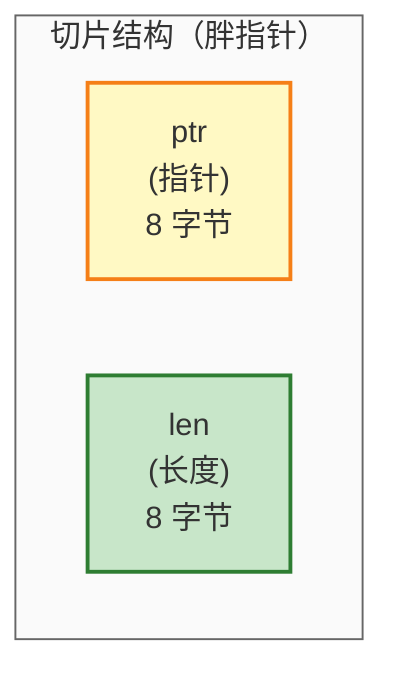
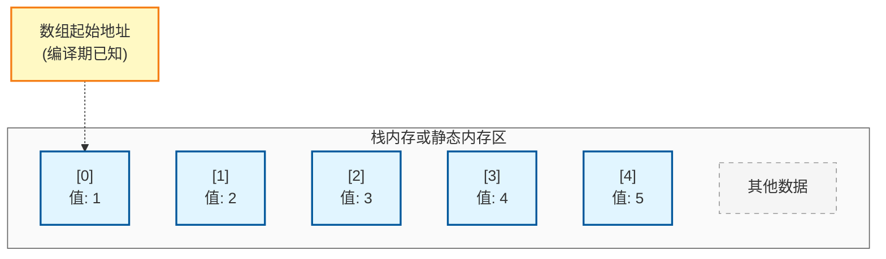
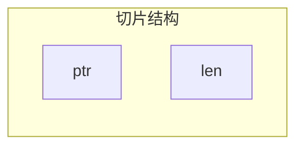

# Mermaid 样式统一方案示例

## 方案 1：使用 classDef（推荐）

在每个 mermaid 图中使用 `classDef` 定义样式类，然后通过 `:::类名` 应用：





## 方案 2：使用 CSS 样式块（如果渲染器支持）

在文档开头定义全局样式：

```html
<style>
.mermaid .ptr { fill: #fff9c4; stroke: #f57f17; stroke-width: 2px; }
.mermaid .len { fill: #c8e6c9; stroke: #2e7d32; stroke-width: 2px; }
.mermaid .array-element { fill: #e1f5ff; stroke: #01579b; stroke-width: 2px; }
.mermaid .inactive { fill: #f5f5f5; stroke: #999; stroke-dasharray: 5 5; }
.mermaid .container { fill: #fafafa; stroke: #666; stroke-width: 1px; }
</style>
```

然后在 mermaid 中使用：



## 方案 3：创建样式指南注释

在文档开头添加样式说明：

```
<!-- 
Mermaid 样式指南：
- 指针字段：黄色 (#fff9c4, #f57f17)
- 长度字段：绿色 (#c8e6c9, #2e7d32)
- 数组元素：蓝色 (#e1f5ff, #01579b)
- 非活跃数据：灰色 (#f5f5f5, #999)
- 容器：浅灰背景 (#fafafa, #666)
-->
```

## 推荐方案

**推荐使用方案 1（classDef）**，原因：
1. ✓ 所有渲染器都支持
2. ✓ 样式定义清晰，易于维护
3. ✓ 可以在单个图表内完整定义
4. ✓ 不依赖外部配置

虽然需要在每个图中重复定义 classDef，但这样可以：
- 保证图表的独立性
- 便于复制到其他文档
- 样式定义集中且易于修改
