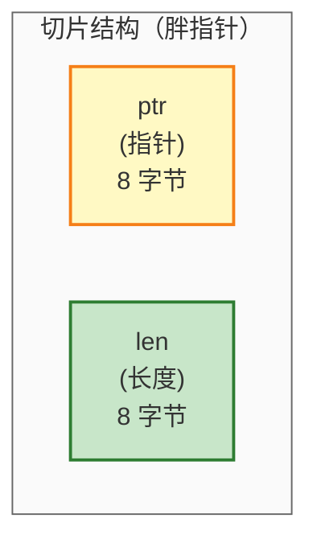
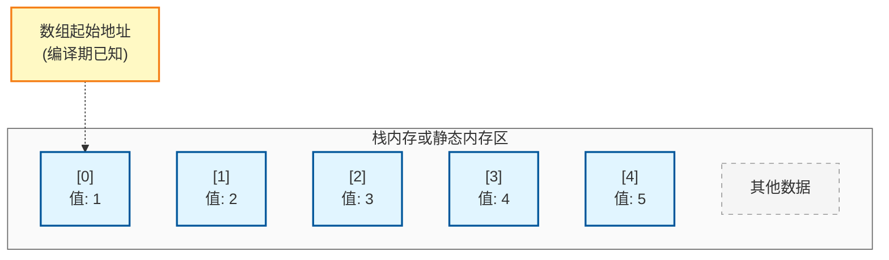
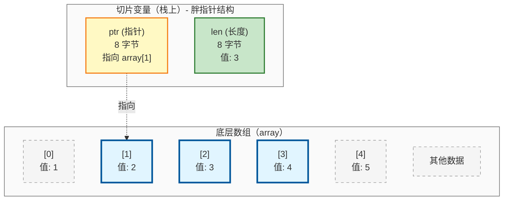

# 【draft】基础语法

本章将介绍Zig的基本语法元素，包括变量声明、数据类型、数组、切片、枚举、联合和结构体。这些是构建Zig程序的基础。

## Zig 编程基础

本节介绍 Zig 编程的基础概念，包括变量声明、命名规范、作用域规则等。这些是编写 Zig 程序的基本要素。

### 变量声明

### 类型系统特点

Zig采用强类型系统，但支持类型推断。与C/C++不同，Zig明确区分：

- **常量（const）**: 编译期或运行期不可变值
- **变量（var）**: 可在运行期修改的值
- **编译期常量（comptime）**: 在编译期计算并内联的值

### 设计理念

1. **显式优于隐式**: 明确区分可变与不可变，减少意外修改
2. **编译期优化**: 编译期常量可以被完全优化
3. **内存安全**: 不可变性防止并发问题
4. **代码可读性**: 一眼就能看出变量是否会被修改

### 应用场景

- **配置参数**：使用`const`，防止意外修改
- **循环计数器**：使用`var`，允许递增
- **数学常量**：使用`comptime`，编译期计算

### 基本语法

Zig 是强类型语言，支持类型推断：

```zig
const std = @import("std");

pub fn main(init: std.process.Init.Minimal) void {
    // 常量声明（不可变）
    const constant: i32 = 42;
    const inferred_const = 100; // 类型推断为 comptime_int
    
    // 变量声明（可变）
    var mutable: i32 = 10;
    var inferred_var = 20; // 类型推断为 i32
    
    mutable = 30; // 合法
    // constant = 50; // 编译错误：常量不可修改
    
    std.debug.print("constant: {}, mutable: {}\n", .{ constant, mutable });
}
```

**预期输出：**
```
constant: 42, mutable: 30
```

### 命名规范

Zig 遵循明确的命名规范，确保代码风格一致且易于理解。

#### 变量命名

**蛇形命名法（snake_case）**：用于变量名

```zig
// ✅ 正确示例
var user_name: []const u8 = undefined;
var current_score: i32 = 0;
var is_active: bool = false;

// ❌ 错误示例
var userName: []const u8 = undefined;
var CurrentScore: i32 = 0;
```

#### 函数命名

**驼峰命名法（camelCase）**：用于函数名

```zig
// ✅ 正确示例
fn calculateTotal() i32 { }
fn processUserData(data: []const u8) void { }
fn isValidEmail(email: []const u8) bool { }

// ❌ 错误示例
fn calculate_total() i32 { }      // 错误：函数应使用驼峰命名
fn CalculateTotal() i32 { }       // 错误：首字母应小写
```

#### 类型命名

- **结构体、枚举、联合的类型名**使用 PascalCase
- **枚举成员名**使用 PascalCase
- **结构体和联合的字段名**使用 snake_case
  - **私有字段和方法**使用下划线前缀

```zig
// ✅ 正确示例
const Person = struct {
    name: []const u8,
    age: u32,
};

const StudentRecord = struct {
    student_id: usize,
    grades: []f32,
};

const Status = enum {
    Pending,
    InProgress,
    Completed,
    Failed,
};

const Result = union {
    success: []const u8,
    error: ErrorType,
};

const Counter = struct {
    _count: usize,              // 私有字段
    
    pub fn init() Counter {
        return .{ ._count = 0 };
    }
    
    pub fn increment(self: *Counter) void {
        self._count += 1;
    }
    
    fn _validate(self: *const Counter) bool {  // 私有方法
        return self._count < 1000;
    }
};

// ❌ 错误示例
const person = struct { };         // 错误：类型名应首字母大写
const student_record = struct { }; // 错误：应使用帕斯卡命名

const Status = enum {
    pending,        // 错误：枚举成员应使用帕斯卡命名
    in_progress,    // 错误：枚举成员应使用帕斯卡命名
};
```

#### 常量命名

**蛇形命名（snake_case）**：用于常量，遵循既有约定时使用全大写

```zig
// ✅ 正确示例 - 常量使用 snake_case
const max_size = 1024;
const default_timeout = 30;
const buffer_size = 4096;
const max_connections = 100;
const version = "1.0.0";

// ✅ 正确示例 - 遵循既有约定时使用 SCREAMING_SNAKE_CASE
const PI = 3.14159;              // 数学常量
const ENOENT = error.FileNotFound; // POSIX 约定
const SIGINT = 2;                // 信号常量

// ❌ 错误示例
const maxSize = 1024;            // 错误：应使用蛇形命名
const MAX_SIZE = 1024;           // 不推荐：普通常量不需要全大写
```

#### 泛型类型参数命名

泛型参数使用**单个大写字母或描述性名称**。

```zig
// ✅ 正确示例 - 单个字母
fn Stack(comptime T: type) type {
    return struct {
        items: []T,
    };
}

fn HashMap(comptime K: type, comptime V: type) type {
    return struct {
        keys: []K,
        values: []V,
    };
}

// ✅ 正确示例 - 描述性名称
fn Queue(comptime Element: type) type {
    return struct {
        elements: []Element,
    };
}

// ❌ 错误示例
fn Stack(comptime t: type) type { }  // 错误：类型参数应大写
fn Stack(comptime TYPE: type) type { } // 错误：不应全大写
```

#### 命名规范总结表

| 标识符类型               | 命名规范               | 示例                         | 说明                              |
| ------------------------ | ---------------------- | ---------------------------- | --------------------------------- |
| 变量                     | snake_case             | `user_name`, `current_score` | 单词间用下划线分隔，全小写        |
| 函数                     | camelCase              | `calculateTotal`, `isValid`  | 首字母小写，后续单词首字母大写    |
| 结构体、枚举、联合的类型 | PascalCase             | `Person`, `StudentRecord`    | 每个单词首字母大写                |
| 结构体和联合的字段       | snake_case             | `student_id`, `age`          | 单词间用下划线分隔，全小写        |
| 枚举成员                 | PascalCase             | `Red`, `InProgress`          | 每个单词首字母大写                |
| 常量                     | snake_case             | `max_size`, `buffer_size`    | 特殊约定可用 SCREAMING_SNAKE_CASE |
| 泛型参数                 | 单个大写字母           | `T`, `K`, `V`                | 或使用描述性名称如 `Element`      |
| 私有字段和方法           | _snake_case _camelCase | `_count`, `_validateInput`   | 下划线前缀                        |

#### 命名最佳实践

1. **使用有意义的名称**：名称应清楚表达用途
   ```zig
   // ✅ 好的命名
   var user_count: usize = 0;
   fn calculateAverage(scores: []f32) f32 { }
   
   // ❌ 不好的命名
   var x: usize = 0;              // 含义不明确
   fn calc(s: []f32) f32 { }      // 名称过于简短
   ```

2. **避免缩写**：除非是广泛认可的缩写
   ```zig
   // ✅ 好的命名
   var error_message: []const u8 = undefined;
   var http_response: Response = undefined;
   
   // ❌ 不好的命名
   var err_msg: []const u8 = undefined;  // 不必要的缩写
   var resp: Response = undefined;       // 缩写不清晰
   ```

3. **布尔值使用 is/has/can 前缀**
   ```zig
   // ✅ 好的命名
   var is_valid: bool = false;
   var has_permission: bool = false;
   var can_write: bool = false;
   
   // ❌ 不好的命名
   var valid: bool = false;       // 缺少前缀
   var permission: bool = false;  // 含义不明确
   ```

4. **函数名使用动词或动词短语**
   ```zig
   // ✅ 好的命名
   fn getName() []const u8 { }
   fn setData(value: i32) void { }
   fn isValid() bool { }
   
   // ❌ 不好的命名
   fn name() []const u8 { }       // 缺少动词
   fn data(value: i32) void { }   // 含义不明确
   ```

### 变量遮蔽规则

Zig **完全禁止**变量遮蔽（Shadowing）。标识符永远不允许使用相同的名称来"隐藏"其他标识符。这意味着：

- **嵌套作用域不能声明同名变量**：内部作用域不能重新声明外部作用域已有的变量名
- **兄弟作用域可以同名**：不嵌套的独立作用域可以使用相同的变量名

```zig
const std = @import("std");

pub fn main(init: std.process.Init.Minimal) void {
    const pi = 3.14;

    {
        // 编译错误：嵌套块中的变量遮蔽了外层的 pi
        // var pi: i32 = 1234; // error: local variable shadows declaration of 'pi'
    }
}

// 兄弟作用域示例：这是合法的
test "separate scopes" {
    {
        const pi = 3.14;
        _ = pi;
    }
    {
        var pi: bool = true;
        _ = &pi; // 合法：这是不同的作用域，不构成遮蔽
    }
}
```

**设计理念**：
- 避免因变量遮蔽导致的逻辑错误
- 提高代码可读性和可维护性
- 编译器能够更早发现潜在的命名冲突
- 一个标识符在其定义的作用域内始终保持相同的含义

### 解包赋值

Zig 支持解包赋值，可以从元组、向量或数组中一次性提取多个值：

```zig
const std = @import("std");

pub fn main(_: std.process.Init.Minimal) void {
    // 元组解包
    const tuple = .{ 1, 2, 3 };
    var x: i32 = undefined;
    var y: i32 = undefined;
    var z: i32 = undefined;
    x, y, z = tuple;
    std.debug.print("元组解包：x={}, y={}, z={}\n", .{ x, y, z });

    // 向量解包
    const vector: @Vector(3, u32) = .{ 7, 8, 9 };
    var a: u32 = undefined;
    var b: u32 = undefined;
    var c: u32 = undefined;
    a, b, c = vector;
    std.debug.print("向量解包：a={}, b={}, c={}\n", .{ a, b, c });

    // 数组解包
    const array = [_]u32{ 4, 5, 6 };
    var p: u32 = undefined;
    var q: u32 = undefined;
    var r: u32 = undefined;
    p, q, r = array;
    std.debug.print("数组解包：p={}, q={}, r={}\n", .{ p, q, r });

    // 混合声明：可以同时声明常量和变量
    const tuple2 = .{ 10, 20, 30 };
    const first, var second: i32, const third = tuple2; // 变量需要显示声明类型
    second = 25; // 可以修改
    std.debug.print("混合声明：{}, {}, {}\n", .{ first, second, third });
}
```

**预期输出：**
```
元组解包：x=1, y=2, z=3
向量解包：a=7, b=8, c=9
数组解包：p=4, q=5, r=6
混合声明：10, 25, 30
```

### 内存管理原则

Zig 采用手动内存管理，没有垃圾回收器。理解内存管理原则对编写高效、安全的 Zig 程序至关重要。

**核心原则**：

1. **显式分配**：明确指定内存分配的位置和方式
2. **明确所有权**：谁分配内存，谁负责释放
3. **避免全局状态**：分配器作为参数传递，而不是使用全局变量

**为什么这样设计？**

- **灵活性**：调用者可以选择最合适的分配器（栈分配器、堆分配器、竞技场分配器等）
- **可测试性**：测试时可以使用自定义分配器跟踪内存使用
- **可组合性**：函数可以轻松组合，不会因为全局状态产生冲突
- **性能**：可以根据场景选择最优的分配策略

**常见分配器类型**：

| 分配器                 | 用途       | 特点                                 |
| ---------------------- | ---------- | ------------------------------------ |
| `DebugAllocator`       | 开发调试   | 检测内存泄漏、双重释放、捕获堆栈跟踪 |
| `page_allocator`       | 简单场景   | 直接使用操作系统页面分配             |
| `ArenaAllocator`       | 批量分配   | 一次性释放所有内存                   |
| `FixedBufferAllocator` | 固定缓冲区 | 使用预分配的缓冲区                   |

> 📖 **深入学习**：内存管理的详细实践（包括分配器传递模式、自定义分配器）请参考[内存管理模型](../part2-advanced/chapter-memory-management.md)。

## 基本数据类型

**整数类型：**
```zig
const std = @import("std");

pub fn main(init: std.process.Init.Minimal) void {
    // 有符号整数
    const signed_i8: i8 = -128;
    const signed_i16: i16 = -32768;
    const signed_i32: i32 = -2147483648;
    const signed_i64: i64 = -9223372036854775808;
    
    // 无符号整数
    const unsigned_u8: u8 = 255;
    const unsigned_u16: u16 = 65535;
    const unsigned_u32: u32 = 4294967295;
    const unsigned_u64: u64 = 18446744073709551615;
    
    // 平台相关大小
    const isize_val: isize = 100; // 指针大小
    const usize_val: usize = 200;
    
    // C ABI 兼容类型
    const c_int_val: c_int = 10;
    const c_long_val: c_long = 20;
}
```

**浮点类型：**
```zig
const std = @import("std");

pub fn main(init: std.process.Init.Minimal) void {
    const float_32: f32 = 3.14159;
    const float_64: f64 = 3.141592653589793;
    const float_128: f128 = 3.14159265358979323846264338327950288;

    std.debug.print("f32: {}, f64: {}, f128: {}\n", .{ float_32, float_64, float_128 });
}
```

**预期输出：**
```
f32: 3.14159, f64: 3.141592653589793, f128: 3.14159265358979323846264338327950288
```

**布尔和字符类型：**
```zig
const bool_val: bool = true;
const char_val: u8 = 'A'; // 字符字面量是 u8 类型
```

### 基本类型转换

#### 为什么需要显式类型转换？

Zig 的设计哲学是"显式优于隐式"，因此不进行隐式类型转换。这带来以下好处：
1. **避免精度丢失**：所有类型转换都是明确的，不会意外丢失数据
2. **提高代码可读性**：类型转换意图清晰可见
3. **减少运行时错误**：编译期就能发现潜在的类型问题

#### 基本类型转换策略

Zig 提供了多种类型转换方式，每种都有特定的用途和安全保证：

| 转换方式        | 用途           | 安全性                                                                                 | 示例          |
| --------------- | -------------- | -------------------------------------------------------------------------------------- | ------------- |
| `@intCast`      | 整数类型间转换 | **运行时安全检查**（Debug/ReleaseSafe模式panic，ReleaseFast/ReleaseSmall为未定义行为） | `u32` → `u8`  |
| `@floatFromInt` | 整数转浮点     | 安全，可能丢失精度                                                                     | `i32` → `f32` |
| `@intFromFloat` | 浮点转整数     | **运行时安全检查**（Debug/ReleaseSafe模式panic，ReleaseFast/ReleaseSmall为未定义行为） | `f64` → `i32` |
| `@truncate`     | 截断高位       | **不安全**，明确意图（不检查范围）                                                     | `i32` → `u8`  |
| `@bitCast`      | 位模式重解释   | **不安全**，保持位模式                                                                 | `f32` → `u32` |

**详细代码示例：**

```zig
const std = @import("std");

pub fn main(_: std.process.Init.Minimal) void {
    // ========================================
    // 1. @intCast - 安全的整数类型转换
    // ========================================
    std.debug.print("=== @intCast 示例 ===\n", .{});

    const small: i32 = 100;
    const small_u8: u8 = @intCast(small); // ✅ OK: 100 在 u8 范围内
    std.debug.print("i32({}) -> u8({})\n", .{ small, small_u8 });

    // ⚠️ 以下代码在 Debug/ReleaseSafe 模式下会 panic
    // const large: i32 = 300;
    // const large_u8: u8 = @intCast(large);  // ❌ panic: 300 超出 u8 范围

    // 在 ReleaseFast/ReleaseSmall 模式下，这是 UB（未定义行为）
    // 编译器不会检查，结果不可预测

    // ========================================
    // 2. @floatFromInt - 整数转浮点
    // ========================================
    std.debug.print("\n=== @floatFromInt 示例 ===\n", .{});

    const int_val: i32 = 42;
    const float_val: f32 = @floatFromInt(int_val); // ✅ OK: 42.0
    std.debug.print("i32({}) -> f32({})\n", .{ int_val, float_val });

    // 大整数转浮点可能丢失精度
    const large_int: i64 = 12345678901234567;
    const large_float: f64 = @floatFromInt(large_int);
    std.debug.print("i64({}) -> f64({d:.2})\n", .{ large_int, large_float });

    // ========================================
    // 3. @intFromFloat - 浮点转整数
    // ========================================
    std.debug.print("\n=== @intFromFloat 示例 ===\n", .{});

    const float_num: f32 = 42.7;
    const int_num: i32 = @intFromFloat(float_num); // ✅ OK: 42（截断小数）
    std.debug.print("f32({}) -> i32({})\n", .{ float_num, int_num });

    // ⚠️ 以下代码在 Debug/ReleaseSafe 模式下会 panic
    // const huge_float: f32 = 1e10;
    // const huge_int: i32 = @intFromFloat(huge_float);  // ❌ panic: 超出 i32 范围

    // ========================================
    // 4. @truncate - 截断高位（不安全）
    // ========================================
    std.debug.print("\n=== @truncate 示例 ===\n", .{});

    const value: u32 = 300;
    const truncated: u8 = @truncate(value); // ✅ OK: 300 % 256 = 44
    std.debug.print("u32({}) -> u8({}) [截断]\n", .{ value, truncated });

    // ========================================
    // 5. @bitCast - 位模式重解释（不安全）
    // ========================================
    std.debug.print("\n=== @bitCast 示例 ===\n", .{});

    const float_bits: f32 = 3.14159;
    const bits: u32 = @bitCast(float_bits); // ✅ OK: 保持位模式
    std.debug.print("f32({}) -> u32(0x{x})\n", .{ float_bits, bits });

    // 反向转换
    const back_to_float: f32 = @bitCast(bits);
    std.debug.print("u32(0x{x}) -> f32({})\n", .{ bits, back_to_float });

    // 注意：@bitCast 要求源类型和目标类型大小相同
    // const wrong: u64 = @bitCast(float_bits);  // ❌ 编译错误：大小不匹配
}
```

**重要区分**：
- `@intCast` 用于**安全转换**：值必须在目标类型范围内，否则 panic
- `@truncate` 用于**不安全的截断**：直接丢弃高位，不检查范围

#### 最佳实践

1. **优先使用安全转换**：`@intCast`、`@floatFromInt` 等有运行时检查的转换
2. **明确不安全操作**：使用 `@truncate`、`@bitCast` 时添加注释说明意图
3. **处理可能的错误**：对于可能失败的转换，先检查范围再使用 `@intCast`，或使用 `std.math.cast`

```zig
const std = @import("std");

// 方式一：手动检查
fn safeConvert(value: i32) !u8 {
    if (value < 0 or value > 255) {
        return error.OutOfRange;
    }
    return @intCast(value);
}

// 方式二：使用 std.math.cast（返回 optional）
fn safeConvert2(value: i32) !u8 {
    return std.math.cast(u8, value) orelse error.OutOfRange;
}

pub fn main(_: std.process.Init.Minimal) !void {
    const value: i32 = 300;
    const safe: u8 = try safeConvert(value);
    std.debug.print("safeConvert({}) -> u8({}) [安全]\n", .{ value, safe });

    const value2: i32 = 300;
    const safe2: u8 = try safeConvert2(value2);
    std.debug.print("safeConvert2({}) -> u8({}) [安全]\n", .{ value2, safe2 });
}

```

## 数组和切片

### 数组 vs 切片：核心概念

在 Zig 中，数组和切片是两个重要但不同的概念：

- **数组**：固定大小，大小是类型的一部分。默认存储在栈上，也可通过分配器存储在堆上（此时返回切片类型）
- **切片**：包含指针和长度两个字段，是对连续内存区域的"视图"。切片本身大小固定，但可以在运行时引用不同长度的数据（而数组长度是编译期常量）。切片可以引用数组、堆分配的内存、字符串字面量等任何连续内存

> 📖 **相关章节**：切片的底层实现涉及指针操作，详细内容请参考[指针与引用类型](../part2-advanced/chapter-pointers.md)。

**为什么区分数组和切片？**

1. **性能**：数组大小编译期已知，可以进行更好的优化
2. **安全**：数组边界检查在编译期进行，切片在运行期检查
3. **灵活性**：切片可以引用数组的任意部分，更灵活

### 数组的核心特性

1. **大小固定**：数组大小在编译期确定，不可改变
2. **类型包含大小**：`[5]i32` 和 `[10]i32` 是不同的类型
3. **值语义**：数组赋值会复制所有元素
4. **内存连续**：元素在内存中连续存储，访问高效

```zig
const std = @import("std");

pub fn main(_: std.process.Init.Minimal) void {
    // 固定大小数组
    // 类型 [5]i32 表示：5个 i32 元素的数组
    const array: [5]i32 = [_]i32{ 1, 2, 3, 4, 5 };

    // 数组长度：编译期已知
    const len = array.len;

    // 访问元素：边界检查在编译期或运行期进行
    const first = array[0];
    const last = array[array.len - 1];

    // 数组遍历
    for (array, 0..) |item, index| {
        std.debug.print("array[{}] = {}\n", .{ index, item });
    }

    std.debug.print("array length: {}, first: {}, last: {}\n", .{ len, first, last });

    // 多维数组：数组的数组
    const matrix: [3][3]i32 = [_][3]i32{
        [_]i32{ 1, 2, 3 },
        [_]i32{ 4, 5, 6 },
        [_]i32{ 7, 8, 9 },
    };
    // 多维数组遍历
    for (matrix, 0..) |row, row_index| {
        for (row, 0..) |item, col_index| {
            std.debug.print("matrix[{}][{}] = {}\n", .{ row_index, col_index, item });
        }
    }
}
```

**预期输出：**
```
array[0] = 1
array[1] = 2
array[2] = 3
array[3] = 4
array[4] = 5
array length: 5, first: 1, last: 5
matrix[0][0] = 1
matrix[0][1] = 2
matrix[0][2] = 3
matrix[1][0] = 4
matrix[1][1] = 5
matrix[1][2] = 6
matrix[2][0] = 7
matrix[2][1] = 8
matrix[2][2] = 9
```

### 数组的实际应用

```zig
// 场景1：编译期已知大小的数据
const BUFFER_SIZE = 1024;
var buffer: [BUFFER_SIZE]u8 = undefined;

// 场景2：固定大小的查找表
const fibonacci = [_]u32{ 1, 1, 2, 3, 5, 8, 13, 21, 34, 55 };

// 场景3：多维矩阵运算
fn matrixMultiply(a: [3][3]f32, b: [3][3]f32) [3][3]f32 {
    var result: [3][3]f32 = undefined;
    for (0..3) |i| {
        for (0..3) |j| {
            var sum: f32 = 0;
            for (0..3) |k| {
                sum += a[i][k] * b[k][j];
            }
            result[i][j] = sum;
        }
    }
    return result;
}
```

### 切片的核心特性

1. **动态大小**：切片大小在运行期确定
2. **胖指针**：包含指针和长度两个字段
> 📖 **深入学习**：胖指针是 Zig 指针系统的重要组成部分，[指针与引用类型](../part2-advanced/chapter-pointers.md)将详细讲解各种指针类型及其应用场景。
3. **引用语义**：切片是对底层内存的引用，不拥有数据
4. **边界检查**：运行期进行边界检查，更安全

```zig
const std = @import("std");

pub fn main(_: std.process.Init.Minimal) void {
    var array = [_]i32{ 1, 2, 3, 4, 5 };

    // 创建切片：从数组中"切出"一部分
    // 切片类型 []i32 包含：指针 + 长度
    const slice: []i32 = array[1..4]; // 包含元素 2, 3, 4

    // 切片长度：运行期可知
    std.debug.print("slice length: {}, first: {}\n", .{ slice.len, slice[0] });

    // 切片指针：指向底层内存
    const ptr = slice.ptr;
    std.debug.print("slice pointer: {any}\n", .{ptr});

    // 修改切片会影响原数组
    slice[0] = 99;
    std.debug.print("array[1] after modification: {}\n", .{array[1]});

    // 切片可以重新切片
    const subslice = slice[0..2]; // 从切片中再切出
    std.debug.print("subslice length: {}\n", .{subslice.len});
}
```

**预期输出：**
```
slice length: 3, first: 2
slice pointer: i32@16f6f24c4
array[1] after modification: 99
subslice length: 2
```

**注意**：`slice pointer` 的输出会因运行环境不同而变化，显示实际的内存地址。

### 切片的内存布局



**64位系统下切片占用 16 字节**（指针 8 字节 + 长度 8 字节）

### 数组 vs 切片：内存布局对比图

**数组的内存布局**：

声明：`var array: [5]i32 = .{ 1, 2, 3, 4, 5 };`



**特点**：
- ✓ 大小固定：编译期确定，类型的一部分
- ✓ 内存连续：所有元素在内存中连续存储
- ✓ 栈分配：通常在栈上分配（除非使用 const 或 static）
- ✓ 直接访问：通过索引直接访问，无间接寻址
- ✓ 无元数据：不存储长度信息（编译期已知）

**切片的内存布局**：

声明：`const slice: []i32 = array[1..4];`



**特点**：
- ✓ 大小动态：运行期确定，存储在 len 字段中
- ✓ 胖指针：包含指针和长度两个部分（共 16 字节）
- ✓ 引用语义：不拥有数据，只是对底层数组的引用
- ✓ 灵活性：可以指向数组的任意子区间
- ✓ 边界检查：运行期进行边界检查，更安全

**内存布局关键差异**：

| 特性           | 数组                     | 切片                    |
| -------------- | ------------------------ | ----------------------- |
| **大小信息**   | 编译期已知，类型的一部分 | 运行期存储在 len 字段中 |
| **内存占用**   | 元素大小 × 元素数量      | 16 字节（指针 + 长度）  |
| **存储位置**   | 栈或静态内存             | 栈上（胖指针）          |
| **数据所有权** | 拥有数据                 | 引用数据（不拥有）      |
| **访问方式**   | 直接访问                 | 间接访问（通过指针）    |
| **边界检查**   | 编译期检查               | 运行期检查              |
| **灵活性**     | 固定大小                 | 动态大小                |

**实际应用示例**：
```zig
const std = @import("std");

pub fn main(_: std.process.Init.Minimal) void {
    var array: [5]i32 = .{ 1, 2, 3, 4, 5 };

    std.debug.print("=== 数组 vs 切片内存布局 ===\n\n", .{});

    std.debug.print("数组信息：\n", .{});
    std.debug.print("  类型：[5]i32\n", .{});
    std.debug.print("  大小：{} 字节\n", .{@sizeOf(@TypeOf(array))});
    std.debug.print("  元素数量：{}\n", .{array.len});
    std.debug.print("  地址：{any}\n\n", .{&array[0]});

    const slice: []i32 = array[1..4];

    std.debug.print("切片信息：\n", .{});
    std.debug.print("  类型：[]i32\n", .{});
    std.debug.print("  大小：{} 字节（胖指针）\n", .{@sizeOf(@TypeOf(slice))});
    std.debug.print("  长度：{}\n", .{slice.len});
    std.debug.print("  指针：{any}\n", .{slice.ptr});
    std.debug.print("  数据地址：{any}\n\n", .{&slice[0]});

    std.debug.print("内存关系：\n", .{});
    std.debug.print("  数组起始地址：{any}\n", .{&array[0]});
    std.debug.print("  切片起始地址：{any}（偏移 1 个元素）\n", .{&slice[0]});
    std.debug.print("  地址差：{} 字节 = {} 个元素\n", .{
        @intFromPtr(&slice[0]) - @intFromPtr(&array[0]),
        (@intFromPtr(&slice[0]) - @intFromPtr(&array[0])) / @sizeOf(i32),
    });
}
```

**预期输出**：
```
=== 数组 vs 切片内存布局 ===

数组信息：
  类型：[5]i32
  大小：20 字节
  元素数量：5
  地址：i32@16f0124d4

切片信息：
  类型：[]i32
  大小：16 字节（胖指针）
  长度：3
  指针：i32@16fc124d8
  数据地址：i32@16fc124d8

内存关系：
  数组起始地址：i32@16fc124d4
  切片起始地址：i32@16fc124d8（偏移 1 个元素）
  地址差：4 字节 = 1 个元素
```

**关键要点**：
1. **数组是值类型**：整个数组存储在栈上，大小固定
2. **切片是引用类型**：只存储指针和长度，引用底层数组
3. **切片更灵活**：可以动态创建、传递，不受固定大小限制
4. **数组更高效**：直接访问，无间接寻址开销
5. **选择建议**：函数参数用切片，局部变量用数组（如果大小已知）

### 切片的实际应用

```zig
// 场景1：函数参数（避免复制大数组）
fn sumSlice(numbers: []const i32) i32 {
    var total: i32 = 0;
    for (numbers) |num| {
        total += num;
    }
    return total;
}

// 场景2：动态数据处理
fn processData(data: []u8) void {
    // 处理任意长度的数据
    for (data) |*byte| {
        byte.* = byte.* ^ 0xFF; // 简单的异或加密
    }
}

// 场景3：字符串处理
fn findSubstring(text: []const u8, pattern: []const u8) ?usize {
    if (pattern.len > text.len) return null;
    
    for (0..text.len - pattern.len + 1) |i| {
        if (std.mem.eql(u8, text[i..i+pattern.len], pattern)) {
            return i;
        }
    }
    return null;
}
```

### 数组 vs 切片：选择指南

| 场景           | 推荐使用 | 原因                 |
| -------------- | -------- | -------------------- |
| 编译期已知大小 | 数组     | 性能更好，编译期检查 |
| 函数参数       | 切片     | 灵活，避免复制       |
| 返回值         | 切片     | 可以返回部分数据     |
| 全局常量       | 数组     | 存储在静态内存       |
| 动态大小       | 切片     | 唯一选择             |

## 哨兵终止数组（Sentinel-Terminated Array）

### 什么是哨兵终止数组？

哨兵终止数组是一种特殊的数组类型，它在数组末尾添加一个特殊的"哨兵值"（sentinel value）来标记数组的结束。这是 C 语言字符串的经典实现方式。

### 为什么需要哨兵终止数组？

1. **C 语言兼容性**：C 字符串以 null（0）结尾，哨兵数组可以直接与 C 代码互操作
2. **无需存储长度**：通过哨兵值判断结束，不需要单独存储长度信息
3. **历史兼容**：许多系统 API 使用哨兵终止字符串

### 语法说明

- `[N:T]`：长度为 N，哨兵值为 T 的数组
- `[:T]`：未知长度，哨兵值为 T 的切片
- 最常见的：`[:0]const u8` - C 风格字符串

```zig
const std = @import("std");

pub fn main(_: std.process.Init.Minimal) void {
    // 哨兵终止数组：以 0 结尾的数组
    // 类型 [5:0]u8 表示：5个元素，哨兵值为0
    const message: [5:0]u8 = "hello".*;

    std.debug.print("消息：{s}\n", .{&message});
    std.debug.print("长度（不含哨兵）：{}\n", .{message.len});
    std.debug.print("哨兵位置：{}\n", .{message.len}); // 哨兵在 index 5

    // 遍历：注意哨兵值不包含在 len 中
    for (message, 0..) |byte, index| {
        std.debug.print("[{}] = {c} ({})\n", .{ index, byte, byte });
    }

    // 转换为哨兵终止切片（类型 [:0]const u8）
    const str: [:0]const u8 = &message;
    std.debug.print("哨兵终止切片长度：{}\n", .{str.len});

    // 实际应用：与 C 函数互操作
    // 可以直接传递给期望 const char* 的 C 函数
    // c_printf("%s\n", message.ptr);
}
```

**注意事项：**

1. **哨兵值不在 `len` 中**：`message.len` 返回 5，但实际占用 6 字节
2. **访问哨兵**：对于哨兵终止数组 `arr`，`arr[arr.len]` 返回哨兵值（本例中为 0）
3. **编译期检查**：Zig 会确保哨兵值正确设置

### 哨兵终止数组 vs 普通数组

| 特性     | 普通数组 `[N]T` | 哨兵数组 `[N:S]T`    |
| -------- | --------------- | -------------------- |
| 长度信息 | 编译期已知      | 编译期已知           |
| 内存布局 | N 个元素        | N+1 个元素（含哨兵） |
| C 兼容性 | 需要转换        | 直接兼容             |
| 安全性   | 更安全          | 需要确保哨兵存在     |

### 实际应用场景

```zig
// 场景1：调用 C 标准库函数
extern "c" fn puts(s: [*:0]const u8) c_int;

pub fn callCFunction() void {
    const message = "Hello from Zig";
    _ = puts(message.ptr); // 直接传递
}

// 场景2：系统调用
const std = @import("std");

pub fn openFile(path: [:0]const u8) !std.fs.File {
    // 许多系统 API 需要哨兵终止字符串
    return std.fs.cwd().openFile(path, .{});
}
```

**多维数组与哨兵结合：**

```zig
const std = @import("std");

pub fn main(init: std.process.Init.Minimal) void {
    // 字符串数组（每个字符串以 0 结尾）
    const names: [3][:0]const u8 = .{ "Alice", "Bob", "Charlie" };

    for (names, 0..) |name, i| {
        std.debug.print("名字 {}：{s}\n", .{ i, name });
    }
}
```

## 枚举（enum）

### 什么是枚举？

枚举（Enumeration）是一种用户定义的类型，它由一组命名的整数值组成。枚举用于表示一组相关的常量值，使代码更具可读性和类型安全性。

### 为什么使用枚举？

1. **类型安全**：编译器确保只使用有效的枚举值
2. **代码可读性**：使用有意义的名称代替魔法数字
3. **穷尽性检查**：switch 语句必须处理所有枚举值
4. **命名空间**：枚举值在枚举类型的命名空间内，避免冲突

### Zig 枚举的独特之处

与其他语言不同，Zig 的枚举：
- 可以指定底层整数类型
- 可以包含方法
- 支持编译期计算
- 与 C 枚举完全兼容

枚举用于定义一组命名的整数值：

```zig
const std = @import("std");

// 基本枚举
// 默认情况下，枚举值从 0 开始自动编号
const Color = enum {
    red,    // 值为 0
    green,  // 值为 1
    blue,   // 值为 2
};

pub fn main(_: std.process.Init.Minimal) void {
    // 枚举字面量：使用 .语法
    const color: Color = .red;

    // switch 处理枚举：必须穷尽所有情况
    const color_name = switch (color) {
        .red => "红色",
        .green => "绿色",
        .blue => "蓝色",
    };
    std.debug.print("颜色：{s}\n", .{color_name});

    // 获取枚举的序数值（整数表示）
    std.debug.print("序值：{}\n", .{@intFromEnum(color)});
    
    // 从整数创建枚举
    const green_value: Color = @enumFromInt(1);
    std.debug.print("从整数创建：{}\n", .{green_value});
}
```

预期输出：
```
颜色：红色
序值：0
从整数创建：.green
```

### 带整数类型的枚举

**为什么指定整数类型？：**
1. **与 C 互操作**：匹配 C 枚举的大小
2. **内存优化**：使用更小的整数类型节省空间
3. **协议兼容**：匹配特定的协议或文件格式
4. **明确值**：为枚举值指定明确的数字

```zig
const std = @import("std");

// 指定底层类型为 u8
const Priority = enum(u8) {
    low = 1,      // 明确指定值
    medium = 5,
    high = 10,
    critical = 20,
};

pub fn main(_: std.process.Init.Minimal) void {
    const p: Priority = .high;
    
    // 获取枚举名称（字符串）
    std.debug.print("优先级：{s}，值：{}\n", .{ @tagName(p), @intFromEnum(p) });

    // 枚举字面量
    const default_priority: Priority = .medium;
    std.debug.print("默认优先级值：{}\n", .{@intFromEnum(default_priority)});
    
    // 实际应用：与 C 代码互操作
    // C 代码：enum { LOW = 1, MEDIUM = 5, HIGH = 10, CRITICAL = 20 };
    // Zig 可以直接使用相同的值
}
```

预期输出：
```
优先级：high，值：10
默认优先级值：5
```

### 枚举方法

Zig 允许在枚举中定义方法，这使得枚举不仅是数据，还包含行为：

```zig
const std = @import("std");

// 带方法的枚举：封装数据和行为
const Direction = enum(u4) {
    north = 0,
    east = 1,
    south = 2,
    west = 3,

    // 实例方法：第一个参数是 self
    fn toString(self: Direction) []const u8 {
        return switch (self) {
            .north => "北",
            .east => "东",
            .south => "南",
            .west => "西",
        };
    }

    // 方法可以返回枚举类型
    fn opposite(self: Direction) Direction {
        return switch (self) {
            .north => .south,
            .east => .west,
            .south => .north,
            .west => .east,
        };
    }
    
    // 关联函数：无 self 参数
    fn allDirections() [4]Direction {
        return .{ .north, .east, .south, .west };
    }
};

pub fn main(_: std.process.Init.Minimal) void {
    const dir: Direction = .north;
    
    // 调用枚举方法
    std.debug.print("方向：{s}\n", .{dir.toString()});
    std.debug.print("相反方向：{s}\n", .{dir.opposite().toString()});
    
    // 调用关联函数
    const all = Direction.allDirections();
    std.debug.print("所有方向数量：{}\n", .{all.len});
}
```

预期输出：
```
方向：北
相反方向：南
所有方向数量：4
```

### 枚举的实际应用场景

```zig
// 场景1：状态机
const State = enum {
    idle,
    running,
    paused,
    stopped,
    
    fn canTransitionTo(self: State, next: State) bool {
        return switch (self) {
            .idle => next == .running,
            .running => next == .paused or next == .stopped,
            .paused => next == .running or next == .stopped,
            .stopped => next == .idle,
        };
    }
}

// 场景2：配置选项
const Config = enum {
    debug,
    release,
    release_safe,
    release_small,
    
    fn optimizeLevel(self: Config) u8 {
        return switch (self) {
            .debug => 0,
            .release, .release_safe => 3,
            .release_small => 2,
        };
    }
}

// 场景3：错误类型
const NetworkError = enum {
    timeout,
    connection_refused,
    dns_failure,
    
    fn description(self: NetworkError) []const u8 {
        return switch (self) {
            .timeout => "连接超时",
            .connection_refused => "连接被拒绝",
            .dns_failure => "DNS 解析失败",
        };
    }
}
```

### 枚举最佳实践

1. **使用有意义的名称**：`UserActive` 而不是 `State1`
2. **添加方法**：将相关逻辑封装在枚举中
3. **穷尽 switch**：利用编译器检查所有情况
4. **文档注释**：为枚举和枚举值添加说明

### 可选枚举值

枚举可以与可选类型结合使用，表示枚举值可能不存在：

```zig
const Status = enum {
    pending,
    running,
    completed,
};

fn getStatus() ?Status {
    return .running; // 或返回 null
}

// 使用 if 解包
if (getStatus()) |status| {
    // status 是 Status 类型
} else {
    // 处理 null 情况
}
```

## 联合（union）和带标签联合（tagged union）

### 什么是联合（Union）？

联合（Union）是一种特殊的数据类型，它允许在同一内存位置存储不同类型的数据。联合的所有成员共享同一块内存，因此联合的大小等于其最大成员的大小。

### 为什么需要联合？

1. **内存效率**：多个数据类型共享同一内存空间，节省内存
2. **类型转换**：可以安全地在不同类型之间重解释内存
3. **多态实现**：带标签联合是实现多态的基础
4. **C 兼容性**：与 C 语言的 union 完全兼容

### Zig 联合的两大类别

Zig 将联合分为两大类：

| 类别           | 特点                   | 适用场景           |
| -------------- | ---------------------- | ------------------ |
| **无标签联合** | 无类型标签，需手动跟踪 | C 互操作、类型转换 |
| **带标签联合** | 有类型标签，自动跟踪   | 类型安全的多态     |

### 无标签联合（Untagged Union）

无标签联合没有类型标签，程序员需要自己跟踪当前活动的成员。根据内存布局的不同，又分为三种：

| 类型             | 内存布局      | 访问非活动成员 | 主要用途           |
| ---------------- | ------------- | -------------- | ------------------ |
| **普通 union**   | 未定义        | ❌ 触发 panic   | 通用场景           |
| **extern union** | 明确（C ABI） | ✅ 允许         | C 互操作、类型转换 |
| **packed union** | 明确（位级）  | ✅ 允许         | 硬件编程、位操作   |

### 普通 union

普通联合是最基础的联合类型，所有成员共享同一内存：

- **内存共享**：所有成员占用同一块内存
- **内存布局**：未定义，编译器可能添加填充字节
- **安全检查**：访问非活动成员会触发运行时 panic

```zig
const std = @import("std");

const Data = union {
    as_i32: i32,
    as_f32: f32,
    as_bytes: [4]u8,
};

pub fn main(_: std.process.Init.Minimal) void {
    // 初始化联合：必须指定一个成员
    var data: Data = .{ .as_i32 = 42 };

    // 正确：访问活动成员
    std.debug.print("as_i32: {}\n", .{data.as_i32});
    
    // 错误：访问非活动成员会触发 panic
    // std.debug.print("as_f32: {}\n", .{data.as_f32}); // panic!
    
    // 修改活动成员
    data = .{ .as_f32 = 3.14 };
    std.debug.print("as_f32: {}\n", .{data.as_f32}); // 现在可以访问
    
    // 内存布局
    std.debug.print("联合大小: {} 字节\n", .{@sizeOf(Data)});
}
```

预期输出：
```
as_i32: 42
as_f32: 3.14
联合大小: 8 字节
```

**注意**：虽然所有成员都是 4 字节，但普通 union 的大小是 8 字节。这是因为普通 union 的内存布局是未定义的，编译器可能会添加填充字节。相比之下，`extern union` 和 `packed union` 的大小会是 4 字节。

### extern union

`extern union` 有明确定义的内存布局，与 C ABI 兼容。

- **内存布局**：明确，遵循 C ABI
- **大小计算**：联合大小 = max(成员大小)
- **类型转换**：允许访问非活动成员

```zig
const std = @import("std");

const Data = extern union {
    as_i32: i32,
    as_f32: f32,
    as_bytes: [4]u8,
};

pub fn main(_: std.process.Init.Minimal) void {
    const data: Data = .{ .as_i32 = 0x41424344 };

    // 可以访问活动成员
    std.debug.print("as_i32: {}\n", .{data.as_i32});

    // 也可以访问非活动成员（类型转换）
    std.debug.print("as_f32: {}\n", .{data.as_f32});
    std.debug.print("as_bytes: {s}\n", .{data.as_bytes});

    // 内存布局
    std.debug.print("联合大小: {} 字节\n", .{@sizeOf(Data)});
}
```

预期输出：
```
as_i32: 1094861636
as_f32: 12.141422
as_bytes: DCBA
联合大小: 4 字节
```

**实际应用：**

```zig
// 场景1：网络协议解析
const Packet = extern union {
    header: struct { version: u8, type: u8, length: u16 },
    raw: [4]u8,
};

// 场景2：硬件寄存器访问
const Register = extern union {
    value: u32,
    bits: packed struct {
        bit0: u1,
        bit1: u1,
        bit2: u1,
        bit3: u1,
        reserved: u4,
        high_bits: u24,
    },
};
```

### packed union

`packed union` 有明确定义的位级内存布局，所有成员必须有相同的位大小：

- **内存布局**：明确，位级精确控制
- **大小计算**：所有成员位大小相同，联合大小 = 成员大小
- **类型转换**：允许访问非活动成员
- **成员限制**：所有成员必须有相同的 `@bitSizeOf`
- **特殊用途**：可以嵌入 `packed struct` 中

**为什么需要 packed union？**

1. **位级精确控制**：当需要精确控制每一位的布局时
2. **硬件寄存器映射**：硬件寄存器通常需要位级精确布局
3. **嵌入 packed struct**：`extern union` 不能放在 `packed struct` 中，但 `packed union` 可以
4. **类型转换**：允许进行类型重解释

```zig
const std = @import("std");

const Data = packed union {
    as_u32: u32,
    as_i32: i32,
    as_f32: f32,
};

pub fn main(_: std.process.Init.Minimal) void {
    const data: Data = .{ .as_u32 = 0x40490FDB }; // π 的 IEEE 754 表示
    
    std.debug.print("as_u32: 0x{X}\n", .{data.as_u32});
    std.debug.print("as_f32: {}\n", .{data.as_f32}); // 3.14159...
}
```

**实际应用：嵌入 packed struct**

```zig
// packed union 可以嵌入 packed struct
const Register = packed struct {
    control: packed union {
        as_u32: u32,
        bits: packed struct {
            enable: u1,
            mode: u3,
            reserved: u28,
        },
    },
    status: u32,
};
```

### 带标签联合（Tagged Union）

带标签联合是联合和枚举的结合体，它在联合中添加一个"标签"（tag），用于标识当前存储的是哪种类型的值。这是 Zig 中实现安全多态的核心机制。

#### 为什么使用带标签联合？

1. **类型安全**：通过标签自动跟踪活动成员，编译器确保只能访问当前类型的字段
2. **模式匹配**：switch 可以穷尽所有可能的情况
3. **多态实现**：实现类似面向对象的"多态"
4. **内存效率**：比接口/继承更高效

#### 两种定义方式

**方式一：显式定义枚举类型（完整语法）**

```zig
// 先定义枚举类型
const ShapeTag = enum {
    circle,
    rectangle,
};

// 再定义带标签联合，引用枚举类型
const Shape = union(ShapeTag) {
    circle: struct { radius: f32 },
    rectangle: struct { width: f32, height: f32 },
};
```

**方式二：匿名标记联合（简化语法，推荐）**

使用 `union(enum)` 语法，编译器自动生成枚举类型：

```zig
// 编译器自动生成枚举标签
const Shape = union(enum) {
    circle: struct { radius: f32 },
    rectangle: struct { width: f32, height: f32 },
};
```

**推荐使用匿名标记联合**，因为它更简洁，且功能完全相同。下面的示例都将使用这种方式。

#### 基本用法

```zig
const std = @import("std");

// 带标签联合：值可以是多种类型之一
const Shape = union(enum) {
    circle: struct { radius: f32 },
    rectangle: struct { width: f32, height: f32 },
    triangle: struct { base: f32, height: f32 },

    fn area(self: Shape) f32 {
        return switch (self) {
            .circle => |c| std.math.pi * c.radius * c.radius,
            .rectangle => |r| r.width * r.height,
            .triangle => |t| t.base * t.height * 0.5,
        };
    }
};

pub fn main(_: std.process.Init.Minimal) void {
    const shapes: [3]Shape = .{
        Shape{ .circle = .{ .radius = 1.0 } },
        Shape{ .rectangle = .{ .width = 3.0, .height = 5.0 } },
        Shape{ .triangle = .{ .base = 6.0, .height = 4.0 } },
    };

    for (shapes, 0..) |shape, i| {
        std.debug.print("形状 {} 面积：{:.2}\n", .{ i, shape.area() });
    }
}
```
预期输出
```
形状 0 面积：3.14
形状 1 面积：15.00
形状 2 面积：12.00
```

#### 带标签联合的方法

带标签联合可以包含方法，这使其不仅是数据容器，还包含行为。方法内部通过 switch 来处理不同的变体，实现类型安全的操作。

```zig
const std = @import("std");

// 带标签联合：实现动态类型的值
const Value = union(enum) {
    integer: i64,
    float: f64,
    boolean: bool,
    string: []const u8,

    // 方法：根据当前类型返回描述
    fn describe(self: Value) []const u8 {
        // switch 自动匹配当前变体
        return switch (self) {
            .integer => "整数",
            .float => "浮点数",
            .boolean => "布尔值",
            .string => "字符串",
        };
    }
    
    // 方法：类型转换
    fn toInt(self: Value) ?i64 {
        return switch (self) {
            .integer => |v| v,
            .float => |v| @intFromFloat(v),
            .boolean => |v| if (v) 1 else 0,
            .string => null,
        };
    }
};

pub fn main(_: std.process.Init.Minimal) void {
    // 创建不同类型的值
    const values: [4]Value = .{
        Value{ .integer = 42 },
        Value{ .float = 3.14 },
        Value{ .boolean = true },
        Value{ .string = "hello" },
    };

    // 遍历并处理每个值
    for (values) |val| {
        std.debug.print("{s} = ", .{val.describe()});
        // 使用 switch 处理不同类型
        switch (val) {
            .integer => |v| std.debug.print("{}\n", .{v}),
            .float => |v| std.debug.print("{}\n", .{v}),
            .boolean => |v| std.debug.print("{}\n", .{v}),
            .string => |v| std.debug.print("{s}\n", .{v}),
        }
    }
}
```

预期输出：
```
整数 = 42
浮点数 = 3.14
布尔值 = true
字符串 = hello
```

#### 带标签联合的实际应用场景

```zig
// 场景1：JSON 值类型
const JsonValue = union(enum) {
    null: void,
    boolean: bool,
    number: f64,
    string: []const u8,
    array: []JsonValue,
    object: std.StringHashMap(JsonValue),
};

// 场景2：AST 节点
const AstNode = union(enum) {
    number: struct { value: f64 },
    binary_op: struct { op: Op, left: *AstNode, right: *AstNode },
    variable: []const u8,
};

// 场景3：网络消息
const Message = union(enum) {
    connect: struct { client_id: u32 },
    disconnect: struct { reason: []const u8 },
    data: []const u8,
    heartbeat: void,
};
```

#### 最佳实践

1. **优先使用带标签联合**：比普通联合更安全
2. **穷尽 switch**：让编译器帮助检查所有情况
3. **添加方法**：将相关逻辑封装在联合中
4. **文档注释**：说明每个变体的用途

### 联合的高级特性

#### 编译时初始化联合

`@unionInit` 是一个编译时内置函数，用于在编译期初始化联合。它的主要用途是在**泛型代码**中，当字段名是编译期参数时，无法使用普通的初始化语法。

> 📖 **相关章节**：更多编译期技巧请参考[编译期计算与元编程](../part2-advanced/chapter-comptime.md)和[泛型编程](../part2-advanced/chapter-generics.md)。

##### 为什么需要 @unionInit？

**问题：普通初始化语法的限制**

```zig
const MyUnion = union {
    int: i32,
    float: f64,
};

// 普通初始化：字段名必须是字面量
const u1 = MyUnion{ .int = 42 };  // ✅ 正确

// 错误：字段名不能是变量
const field_name = "int";
// const u2 = MyUnion{ .field_name = 42 };  // ❌ 编译错误
```

**解决：使用 @unionInit**

```zig
const std = @import("std");

const MyUnion = union {
    int: i32,
    float: f64,
    string: []const u8,
};

pub fn main(init: std.process.Init.Minimal) void {
    // 普通初始化
    const u1 = MyUnion{ .int = 42 };
    
    // 使用 @unionInit：字段名可以是编译期字符串
    const u2 = @unionInit(MyUnion, "float", 3.14);
    const u3 = @unionInit(MyUnion, "string", "hello");
    
    std.debug.print("u1: {}\n", .{u1.int});
    std.debug.print("u2: {}\n", .{u2.float});
    std.debug.print("u3: {s}\n", .{u3.string});
}
```

##### @unionInit 的实际应用

**场景1：泛型函数中动态选择字段**

```zig
// 根据编译期参数选择字段
fn initUnion(comptime field: []const u8, value: anytype) MyUnion {
    // 字段名是编译期参数，必须用 @unionInit
    return @unionInit(MyUnion, field, value);
}

const u1 = initUnion("int", 42);
const u2 = initUnion("float", 3.14);
```

**场景2：根据条件选择变体**

```zig
fn createValue(is_int: bool) MyUnion {
    // 根据运行时条件选择编译期字段名
    if (is_int) {
        return @unionInit(MyUnion, "int", 42);
    } else {
        return @unionInit(MyUnion, "float", 3.14);
    }
}
```

**场景3：序列化/反序列化**

```zig
// 从字符串字段名初始化联合（常见于 JSON 解析）
fn parseField(comptime U: type, comptime field_name: []const u8, value: anytype) U {
    return @unionInit(U, field_name, value);
}
```

#### 获取联合的标签名

`@tagName` 是一个内置函数，用于获取带标签联合当前变体的名称字符串。这在日志记录、调试和序列化时非常有用。

使用 `@tagName` 获取当前联合变体的名称：

```zig
const std = @import("std");

const Result = union(enum) {
    success: i32,
    failure: []const u8,
};

pub fn main(_: std.process.Init.Minimal) void {
    const r1 = Result{ .success = 100 };
    const r2 = Result{ .failure = "连接失败" };
    
    // 获取标签名：返回编译期字符串
    std.debug.print("r1 标签: {s}\n", .{@tagName(r1)}); // 输出: success
    std.debug.print("r2 标签: {s}\n", .{@tagName(r2)}); // 输出: failure
    
    // 在 switch 中使用
    switch (r1) {
        .success => |value| std.debug.print("成功: {}\n", .{value}),
        .failure => |msg| std.debug.print("失败: {s}\n", .{msg}),
    }
}
```

##### @tagName 的实际应用

```zig
// 场景1：日志记录
fn logResult(result: Result) void {
    std.log.info("Result type: {s}", .{@tagName(result)});
}

// 场景2：序列化
fn serialize(result: Result, writer: anytype) !void {
    try writer.print("{{\"type\":\"{s}\",", .{@tagName(result)});
    switch (result) {
        .success => |v| try writer.print("\"value\":{}}}", .{v}),
        .failure => |m| try writer.print("\"message\":\"{s}\"}}", .{m}),
    }
}

// 场景3：调试输出
fn debugValue(val: Value) void {
    std.debug.print("Value({s}): ", .{@tagName(val)});
    switch (val) {
        .int => |v| std.debug.print("{}\n", .{v}),
        .float => |v| std.debug.print("{}\n", .{v}),
        .string => |v| std.debug.print("{s}\n", .{v}),
        .none => std.debug.print("(none)\n", .{}),
    }
}
```

## 结构体（struct）

### 什么是结构体？

结构体（Struct）是 Zig 中定义复合类型的主要方式，它将多个相关的数据字段组合成一个单一的逻辑单元。结构体可以包含字段（数据）和方法（行为），是 Zig 程序组织代码的基础构建块。

### 为什么需要结构体？

1. **数据封装**：将相关的数据组合在一起，提高代码可读性
2. **类型抽象**：创建自定义类型，表达业务领域概念
3. **代码复用**：通过方法实现行为的复用
4. **内存控制**：精确控制数据的内存布局

### Zig 结构体的特点

| 特性           | 说明                                   |
| -------------- | -------------------------------------- |
| 字段默认不可变 | 字段默认是 `const`，需要修改时使用指针 |
| 支持方法       | 可以定义实例方法和关联函数             |
| 编译期泛型     | 使用 `comptime` 参数实现泛型           |
| 多种布局       | 支持 `packed`、`extern` 等布局方式     |
| 零成本抽象     | 编译期展开，无运行时开销               |

### 结构体的核心概念

结构体由字段和方法组成：

- **字段**：存储数据的变量，可以有默认值
- **方法**：带有 `self` 参数的函数
- **关联函数**：不带 `self` 参数的函数（类似静态方法）

```zig
const std = @import("std");

// 定义结构体：使用 struct 关键字
const Point = struct {
    x: f32,
    y: f32,
};

// 带方法的结构体
const Rectangle = struct {
    width: f32,
    height: f32,

    // 实例方法：第一个参数是 self
    // self 是值类型，方法内不能修改
    fn area(self: Rectangle) f32 {
        return self.width * self.height;
    }

    // 修改自身的方法：需要指针参数
    // 使用 *Rectangle 表示可变指针
    fn scale(self: *Rectangle, factor: f32) void {
        self.width *= factor;
        self.height *= factor;
    }

    // 关联函数（无 self 参数）
    // 类似其他语言的静态方法/构造函数
    fn square(size: f32) Rectangle {
        return Rectangle{
            .width = size,
            .height = size,
        };
    }
};

pub fn main(_: std.process.Init.Minimal) void {
    // 创建结构体实例：使用 .{} 语法
    var rect = Rectangle{
        .width = 10.0,
        .height = 5.0,
    };

    // 调用方法
    std.debug.print("面积: {d:.2}\n", .{rect.area()});

    // 修改结构体：通过指针方法
    rect.scale(2.0);
    std.debug.print("放大后面积: {d:.2}\n", .{rect.area()});

    // 使用关联函数创建实例
    const sq = Rectangle.square(4.0);
    std.debug.print("正方形面积: {d:.2}\n", .{sq.area()});
}
```

预期输出：
```
面积: 50.00
放大后面积: 200.00
正方形面积: 16.00
```

### 结构体的实际应用场景

```zig
// 场景1：配置管理
const Config = struct {
    host: []const u8 = "localhost",
    port: u16 = 8080,
    max_connections: usize = 100,
    
    fn loadFromFile(path: []const u8) !Config {
        // 从文件加载配置
        return Config{};
    }
};

// 场景2：状态机
const StateMachine = struct {
    state: State,
    data: []u8,
    
    const State = enum { idle, running, paused };
    
    fn transition(self: *StateMachine, new_state: State) void {
        self.state = new_state;
    }
};

// 场景3：资源管理
const File = struct {
    handle: ?std.fs.File,
    path: []const u8,
    
    fn open(path: []const u8) !File {
        return File{
            .handle = try std.fs.cwd().openFile(path, .{}),
            .path = path,
        };
    }
    
    fn close(self: *File) void {
        if (self.handle) |h| {
            h.close();
            self.handle = null;
        }
    }
};
```

### 嵌套结构体

嵌套结构体是指一个结构体包含另一个结构体作为字段，用于表达复杂的数据层次关系。

#### 为什么使用嵌套结构体？

1. **逻辑分组**：将相关的数据组织在一起，形成清晰的数据结构
2. **类型抽象**：将复杂的概念抽象为独立的类型组合和嵌套，提高代码可读性
3. **组合关系**：表达"整体-部分"的关系，内层结构体是外层的一部分

**示例对比**：

```zig
// ❌ 不使用嵌套：字段分散，难以理解
const Person = struct {
    name: []const u8,
    age: u32,
    street: []const u8,      // 地址字段分散
    city: []const u8,
    zip_code: []const u8,
};

// ✅ 使用嵌套：逻辑清晰，地址是一个整体
const Address = struct {
    street: []const u8,
    city: []const u8,
    zip_code: []const u8,
};

const Person = struct {
    name: []const u8,
    age: u32,
    address: Address,  // 地址作为一个整体
};
```

#### 基本用法

```zig
const std = @import("std");

// 内层结构体
const Address = struct {
    street: []const u8,
    city: []const u8,
    zip_code: []const u8,
};

// 外层结构体：包含 Address 类型的字段
const Person = struct {
    name: []const u8,
    age: u32,
    address: Address,  // 嵌套结构体

    fn describe(self: Person) void {
        std.debug.print("{s}, {d} 岁\n", .{ self.name, self.age });
        std.debug.print("地址: {s}, {s}, {s}\n", .{
            self.address.street,
            self.address.city,
            self.address.zip_code,
        });
    }
};

pub fn main(_: std.process.Init.Minimal) void {
    // 创建嵌套结构体实例
    const person = Person{
        .name = "张三",
        .age = 30,
        .address = Address{
            .street = "中山路 123 号",
            .city = "北京",
            .zip_code = "100000",
        },
    };

    person.describe();
}
```

预期输出：
```
张三, 30 岁
地址: 中山路 123 号, 北京, 100000
```

### 结构体布局

结构体布局（Struct Layout）是指结构体字段在内存中的排列方式，包括字段的顺序、对齐方式和填充字节。Zig 提供了三种布局方式，让开发者可以根据需求在性能、内存效率和兼容性之间做出选择。

结构体不同的布局方式影响：
- **内存大小**：packed 结构体更紧凑
- **对齐方式**：影响访问效率和兼容性
- **C 兼容性**：extern 布局与 C 语言兼容

**布局选择指南**

| 布局方式 | 使用场景         | 特点                     |
| -------- | ---------------- | ------------------------ |
| 默认     | 大多数情况       | 编译器优化，可能重排字段 |
| packed   | 位操作、协议解析 | 紧凑存储，无填充         |
| extern   | 与 C 互操作      | 遵循 C ABI               |

```zig
const std = @import("std");

// 编译器可重排字段优化布局: b(4) + c(2) + a(1) + pad(1) = 8字节
const AutoLayout = struct {
    a: u8,
    b: u32,
    c: u16,
};

// @bitSizeOf=56位(7字节), 但@sizeOf需满足u32的4字节对齐 → 8字节
const PackedStruct = packed struct {
    a: u8,
    b: u32,
    c: u16,
};

// C ABI按声明顺序: a(1)+pad(3)+b(4)+c(2)+pad(2) = 12字节
const ExternStruct = extern struct {
    a: u8,
    b: u32,
    c: u16,
};

pub fn main(_: std.process.Init.Minimal) void {
    std.debug.print("AutoLayout 大小: {} 字节\n", .{@sizeOf(AutoLayout)});
    std.debug.print("PackedStruct 大小: {} 字节\n", .{@sizeOf(PackedStruct)});
    std.debug.print("ExternStruct 大小: {} 字节\n", .{@sizeOf(ExternStruct)});
}
```

预期输出：
```
AutoLayout 大小: 8 字节
PackedStruct 大小: 8 字节
ExternStruct 大小: 12 字节
```

### 匿名结构体

匿名结构体是没有类型名称的结构体，使用 `.{}` 语法直接创建实例，类型由编译器推断。

#### 匿名结构体 vs 命名结构体

| 特性     | 命名结构体               | 匿名结构体         |
| -------- | ------------------------ | ------------------ |
| 类型名称 | 有（如 `Point`）         | 无                 |
| 定义方式 | `const Name = struct {}` | 直接使用 `.{}`     |
| 可复用性 | 高，可在多处使用         | 低，通常一次性使用 |
| 类型检查 | 编译期检查               | 编译期推断         |

#### 匿名结构体 vs 元组

- **匿名结构体**：字段有名称，如 `.{ .x = 1, .y = 2 }`
- **元组**：字段无名称，用索引访问，如 `.{ 1, 2 }`

#### 基本用法

```zig
const std = @import("std");

pub fn main(_: std.process.Init.Minimal) void {
    // 匿名结构体：字段有名称
    const point = .{ .x = 10, .y = 20 };
    std.debug.print("点坐标: ({}, {})\n", .{ point.x, point.y });

    // 类型推断：编译器自动推断字段类型
    const person = .{ .name = "Alice", .age = 30 };
    std.debug.print("{s} 的年龄是 {}\n", .{ person.name, person.age });
}
```

### 结果位置语义

Zig 的"结果位置语义"（Result Location Semantics）是一种类型推断机制，当目标类型已知时，可以省略匿名结构体的类型名。

#### 核心概念

**工作原理**：编译器根据上下文（变量类型、函数参数、返回值）推断匿名结构体的类型。

**对比示例**：

```zig
// ❌ 冗长：类型重复出现
const point: Point = Point{ .x = 1.0, .y = 2.0 };

// ✅ 简洁：结果位置语义
const point: Point = .{ .x = 1.0, .y = 2.0 };
```

#### 适用场景

| 场景           | 说明                             | 示例                                        |
| -------------- | -------------------------------- | ------------------------------------------- |
| **变量声明**   | 类型注解提供了结果位置           | `const p: Point = .{ .x = 1.0, .y = 2.0 };` |
| **函数参数**   | 函数签名提供了结果位置           | `printPoint(.{ .x = 1.0, .y = 2.0 });`      |
| **返回值**     | 返回类型提供了结果位置           | `return .{ .x = 0.0, .y = 0.0 };`           |
| **嵌套结构体** | 外层字段的类型已知，内层可以省略 | `.top_left = .{ .x = 0.0, .y = 0.0 }`       |

#### 完整示例

```zig
const std = @import("std");

const Point = struct {
    x: f32,
    y: f32,
};

const Rectangle = struct {
    top_left: Point,
    bottom_right: Point,
};

fn printPoint(p: Point) void {
    std.debug.print("Point({}, {})\n", .{ p.x, p.y });
}

pub fn main(_: std.process.Init.Minimal) void {
    // 完整写法
    const p1 = Point{ .x = 1.0, .y = 2.0 };
    printPoint(p1);

    // 结果位置语义：类型已知时可以省略类型名
    const p2: Point = .{ .x = 3.0, .y = 4.0 };
    printPoint(p2);

    // 函数参数中的简写
    printPoint(.{ .x = 5.0, .y = 6.0 });

    // 嵌套结构体的简写
    const rect: Rectangle = .{
        .top_left = .{ .x = 0.0, .y = 0.0 },
        .bottom_right = .{ .x = 10.0, .y = 10.0 },
    };

    std.debug.print("矩形: ({}, {}) 到 ({}, {})\n", .{
        rect.top_left.x,
        rect.top_left.y,
        rect.bottom_right.x,
        rect.bottom_right.y,
    });
}
```

预期输出：
```
Point(1, 2)
Point(3, 4)
Point(5, 6)
矩形: (0, 0) 到 (10, 10)
```

#### 注意事项

**1. 类型必须明确**

```zig
const Point = struct { x: f32, y: f32 };
const Vec2 = struct { x: f32, y: f32 };

// ❌ 错误：类型不明确，编译器无法推断
// const p = .{ .x = 1.0, .y = 2.0 };

// ✅ 正确：类型注解明确
const p1: Point = .{ .x = 1.0, .y = 2.0 };
const p2: Vec2 = .{ .x = 1.0, .y = 2.0 };
```

**2. 字段名必须匹配**

```zig
const Point = struct { x: f32, y: f32 };

// ❌ 错误：字段名不匹配
// const p: Point = .{ .a = 1.0, .b = 2.0 };

// ✅ 正确：字段名匹配
const p: Point = .{ .x = 1.0, .y = 2.0 };
```

**3. 所有必填字段必须提供**

```zig
const Point = struct { x: f32, y: f32 };

// ❌ 错误：缺少字段 y
// const p: Point = .{ .x = 1.0 };

// ✅ 正确：提供所有必填字段
const p: Point = .{ .x = 1.0, .y = 2.0 };
```

#### 优势总结

| 优势           | 说明                                   |
| -------------- | -------------------------------------- |
| **减少冗余**   | 避免类型名重复，代码更简洁             |
| **提高可读性** | 关注数据本身，而非类型声明             |
| **类型安全**   | 编译器仍然进行完整的类型检查           |
| **重构友好**   | 修改类型名时，不需要修改所有初始化代码 |

#### 最佳实践

1. **优先使用简写**：当类型明确时，使用 `.{}` 语法
2. **保持一致性**：在同一代码库中统一使用风格
3. **避免歧义**：如果类型不明确，显式写出类型名
4. **利用嵌套**：嵌套结构体时，内层类型也可以省略

### 字段默认值

结构体字段可以定义默认值，简化初始化过程，提高代码可读性。

#### 基本语法

在字段定义时直接赋值：

```zig
const Config = struct {
    host: []const u8 = "localhost",
    port: u16 = 8080,
    timeout: u32 = 30,
    debug: bool = false,
};
```

#### 使用方式

**1. 部分指定，其余使用默认值**

```zig
const cfg1 = Config{
    .host = "example.com",
    // port, timeout, debug 自动使用默认值
};
```

**2. 全部使用默认值**

```zig
const cfg2 = Config{};
```

**3. 覆盖所有默认值**

```zig
const cfg3 = Config{
    .host = "example.com",
    .port = 443,
    .timeout = 60,
    .debug = true,
};
```

#### 默认实例模式

对于需要共享的默认配置，可以定义默认实例常量：

```zig
const Threshold = struct {
    minimum: f32,
    maximum: f32,
    
    // 定义默认实例
    const default: Threshold = .{
        .minimum = 0.25,
        .maximum = 0.75,
    };
};

// 使用默认实例
const threshold: Threshold = .default;
```

#### 完整示例

```zig
const std = @import("std");

const Config = struct {
    host: []const u8 = "localhost",
    port: u16 = 8080,
    timeout: u32 = 30,
    debug: bool = false,
};

const Threshold = struct {
    minimum: f32,
    maximum: f32,
    
    const default: Threshold = .{
        .minimum = 0.25,
        .maximum = 0.75,
    };
};

pub fn main(init: std.process.Init.Minimal) void {
    // 部分指定
    const cfg1 = Config{
        .host = "example.com",
    };
    std.debug.print("配置: {s}:{}\n", .{ cfg1.host, cfg1.port });
    
    // 全部默认
    const cfg2 = Config{};
    std.debug.print("默认端口: {}\n", .{cfg2.port});
    
    // 使用默认实例
    const threshold: Threshold = .default;
    std.debug.print("阈值范围: {} - {}\n", .{ threshold.minimum, threshold.maximum });
}
```

预期输出：
```
配置: example.com:8080
默认端口: 8080
阈值范围: 0.25 - 0.75
```

#### 注意事项

**1. 默认值必须是编译期常量**

```zig
// ❌ 错误：运行时值不能作为默认值
// fn getDefaultValue() u32 { return 42; }
// const Config = struct {
//     value: u32 = getDefaultValue(),
// };

// ✅ 正确：编译期常量
const Config = struct {
    value: u32 = 42,
};
```

**2. 没有默认值的字段必须显式提供**

```zig
const Point = struct {
    x: f32,
    y: f32,
};

// ❌ 错误：缺少字段 y
// const p = Point{ .x = 1.0 };

// ✅ 正确：提供所有字段
const p = Point{ .x = 1.0, .y = 2.0 };
```

**3. 默认实例模式 vs 字段默认值**

| 方式           | 适用场景                 | 优点             |
| -------------- | ------------------------ | ---------------- |
| **字段默认值** | 每个字段有独立的默认值   | 灵活，可部分覆盖 |
| **默认实例**   | 需要共享一组相关的默认值 | 一致性，便于维护 |

#### 字段默认值的优势

- **简化初始化**：避免重复填写相同的值
- **提高可读性**：只关注重要的配置项
- **便于维护**：修改默认值只需改一处
- **向后兼容**：添加新字段时提供默认值，不影响现有代码

### 泛型结构体

Zig 支持泛型结构体，允许创建类型参数化的结构体，在编译时生成具体类型。这是实现代码复用和类型安全的重要机制。

> 📖 **深入学习**：泛型结构体的完整实现、高级用法和更多示例请参考[泛型编程](../part2-advanced/chapter-generics.md)章节。

#### 为什么使用泛型结构体？

1. **代码复用**：同一套代码适用于多种类型
2. **类型安全**：编译期检查，避免运行时错误
3. **性能优化**：编译期特化，无运行时开销

#### @This() 函数

在定义泛型结构体时，经常需要引用当前正在定义的类型。Zig 提供了 `@This()` 函数来获取当前类型：

```zig
const std = @import("std");

// 泛型结构体：返回结构体类型的函数
fn Vector(comptime T: type) type {
    return struct {
        x: T,
        y: T,
        z: T,

        // 使用 @This() 获取当前类型
        const Self = @This();

        // 泛型方法
        fn add(self: Self, other: Self) Self {
            return .{
                .x = self.x + other.x,
                .y = self.y + other.y,
                .z = self.z + other.z,
            };
        }
    };
}

pub fn main(_: std.process.Init.Minimal) void {
    // 创建 f32 类型的向量
    const Vec3f = Vector(f32);
    const v1 = Vec3f{ .x = 1.0, .y = 2.0, .z = 3.0 };
    const v2 = Vec3f{ .x = 4.0, .y = 5.0, .z = 6.0 };

    const v3 = v1.add(v2);
    std.debug.print("v1 + v2 = ({d:.1}, {d:.1}, {d:.1})\n", .{ v3.x, v3.y, v3.z });
}
```

预期输出：
```
v1 + v2 = (5.0, 7.0, 9.0)
```

**为什么需要 @This()？**

1. **匿名结构体**：泛型函数返回的结构体没有名称，需要用 `@This()` 引用
2. **递归类型**：定义引用自身的类型（如链表节点）
3. **代码清晰**：用 `Self` 代替具体类型名，提高可读性

## 元组（Tuple）

### 什么是元组？

元组（Tuple）是一种特殊的匿名结构体，其字段没有名称，而是使用数字索引（0, 1, 2...）访问。元组可以包含不同类型的元素，是 Zig 中处理异构数据集合的轻量级方式。

### 为什么要使用元组？

1. **临时数据组合**：不需要定义专门的结构体
2. **多返回值**：函数可以返回多个值
3. **类型安全**：编译期检查每个位置的元素类型
4. **简洁语法**：使用 `.{}` 快速创建

### 元组 vs 结构体 vs 数组

| 特性     | 元组               | 结构体         | 数组         |
| -------- | ------------------ | -------------- | ------------ |
| 字段访问 | 索引（0, 1, 2...） | 名称           | 索引         |
| 元素类型 | 可以不同           | 可以不同       | 必须相同     |
| 定义方式 | 匿名               | 命名类型       | 命名类型     |
| 适用场景 | 临时数据、多返回值 | 长期存储、复用 | 同类数据集合 |

### 基本用法

```zig
const std = @import("std");

pub fn main(_: std.process.Init.Minimal) void {
    // 创建元组：使用 .{} 语法
    // 元组可以包含不同类型的元素
    const tuple = .{ 1, "hello", 3.14, true };

    // 访问元素（从 0 开始索引）
    std.debug.print("第一个元素: {}\n", .{tuple[0]});
    std.debug.print("第二个元素: {s}\n", .{tuple[1]});
    std.debug.print("第三个元素: {}\n", .{tuple[2]});

    // 获取元组长度：编译期已知
    std.debug.print("元组长度: {}\n", .{tuple.len});

    // 遍历元组：必须使用 inline for
    // 因为每个元素的类型可能不同
    inline for (tuple, 0..) |item, index| {
        std.debug.print("tuple[{}] = {any}\n", .{ index, item });
    }

    // 元组类型：显示每个字段的类型
    const TupleType = @TypeOf(tuple);
    std.debug.print("元组类型: {}\n", .{TupleType});
}
```

预期输出：
```
第一个元素: 1
第二个元素: hello
第三个元素: 3.14
元组长度: 4
tuple[0] = 1
tuple[1] = { 104, 101, 108, 108, 111 }
tuple[2] = 3.14
tuple[3] = true
元组类型: struct { comptime comptime_int = 1, comptime *const [5:0]u8 = "hello", comptime comptime_float = 3.14, comptime bool = true }
```

### 元组的特点

- 字段名是数字索引（0, 1, 2...）
- 可以包含不同类型的元素
- 常用于函数返回多个值
- 支持解包赋值
- 与结构体共享底层实现，只是字段名为数字

## 块表达式（Block Expression）

在 Zig 中，块（Block）不仅是作用域，还可以作为表达式返回值，但**必须使用标签**。

### 基本语法

```zig
const result = blk: {
    const a = 10;
    const b = 20;
    break :blk a + b;  // 使用 break :label 返回值
};
```

**要点**：
- 块开始处必须有标签（如 `blk:`）
- 使用 `break :label value` 返回值
- 不带标签的块不能返回值，只是一个作用域
- **所有分支的返回值类型必须一致**

### 类型一致性要求

块表达式的所有退出路径必须返回相同类型的值：

```zig
// ❌ 错误：不同分支返回不同类型
const result = blk: {
    if (condition) {
        break :blk 42;      // i32
    } else {
        break :blk "hello"; // 编译错误：类型不匹配
    }
};

// ✅ 正确：所有分支返回相同类型
const result = blk: {
    if (value < 10) break :blk "小";
    if (value < 20) break :blk "中";
    break :blk "大";  // 所有分支都返回 []const u8
};
```

### 完整示例

```zig
const std = @import("std");

pub fn main(_: std.process.Init.Minimal) void {
    // 基本用法：计算并返回值
    const result = blk: {
        const a = 10;
        const b = 20;
        break :blk a + b;
    };
    std.debug.print("块表达式结果: {}\n", .{result});

    // 条件返回：在条件分支中提前退出
    const value: i32 = 15;
    const category = blk: {
        if (value < 10) break :blk "小";
        if (value < 20) break :blk "中";
        break :blk "大";
    };
    std.debug.print("值 {} 的类别: {s}\n", .{ value, category });

    // 嵌套块：使用不同标签区分层级
    const nested = outer: {
        const inner = inner: {
            break :inner 5;
        };
        break :outer inner * 2;
    };
    std.debug.print("嵌套块结果: {}\n", .{nested});
}
```

预期输出：
```
块表达式结果: 30
值 15 的类别: 中
嵌套块结果: 10
```

## 字符和字符串

Zig 提供了强大的字符和字符串支持，原生支持 Unicode，并且字符串字面量具有独特的类型安全特性。

### 核心概念

- **字符**：Unicode 码位，类型为 `comptime_int`
- **字符串**：以 null 结尾的字节数组指针，类型为 `*const [N:0]u8`
- **多行字符串**：使用 `\\` 语法，不处理转义

> 📖 **深入学习**：字符串格式化（如 `{s}`, `{c}`, `{d}` 等格式说明符）的详细用法请参考[标准库常用模块](../part2-advanced/chapter-standard-library.md#字符串格式化)中的格式化输出部分。

### Unicode 码位与 UTF-8 编码

**核心概念**：
- **Unicode 码位**：字符的唯一标识符，32 位无符号整数[^1]（如 '我' = 0x6211）
- **UTF-8 编码**：不定长编码方式，一个码位对应 1-4 个字节（如 '我' = E6 88 91，3字节）

[^1]: Unicode 码位的实际范围是 0x0000 到 0x10FFFF（21 位），通常用 32 位类型存储以方便处理。

**UTF-8 编码长度规则**：
- 1 字节：ASCII 字符（0x00-0x7F），如 'A' = 0x41
- 2 字节：部分欧洲字符（0x80-0x7FF）
- 3 字节：大部分常用字符，包括中文（0x800-0xFFFF）
- 4 字节：辅助平面字符，如部分表情符号（0x10000-0x10FFFF）

**Zig 的处理方式**：
- **字符字面量**（`'我'`）：存储为 Unicode 码位，类型是 `comptime_int`
- **字符串字面量**（`"我"`）：存储为 UTF-8 编码的字节序列，类型是 `*const [N:0]u8`

**示例：字符 vs 字符串**

```zig
const std = @import("std");

pub fn main(_: std.process.Init.Minimal) void {
    // 字符：Unicode 码位
    const ch = '我';
    std.debug.print("字符码位: 0x{x}\n", .{ch});  // 0x6211

    // 字符串：UTF-8 编码
    const str = "我";
    std.debug.print("字符串长度: {} 字节\n", .{str.len});  // 3 字节

    // 注意：str[0] 是第一个字节，不是第一个字符！
    std.debug.print("第一个字节: 0x{x}\n", .{str[0]});  // 0xE6
}
```

预期输出：
```
字符码位: 0x6211
字符串长度: 3 字节
第一个字节: 0xe6
```

**重要提示**：
- 字符串的 `len` 是字节数，不是字符数
- 字符串索引访问的是字节，不是字符
- 遍历 Unicode 字符串需要使用标准库的迭代器

### Unicode 码位字面量

单引号用于字符字面量，得到 Unicode 码位：

```zig
const std = @import("std");

pub fn main(_: std.process.Init.Minimal) void {
    // ASCII 字符
    const letter = 'A';
    std.debug.print("字符: {c}, 码位: {}\n", .{ letter, letter });

    // Unicode 字符（中文）
    const me_zh = '我';
    std.debug.print("字符: {0u} = 码位: 0x{0x}\n", .{me_zh});
    // 输出: 我 = 0x6211

    // 表情符号
    const emoji = '☔';
    std.debug.print("表情: {0u}, 码位: 0x{0x}\n", .{emoji});

    // 类型是 comptime_int
    const char_value: comptime_int = 'Z';
    std.debug.print("comptime_int 值: {}\n", .{char_value});
}
```

预期输出：
```
字符: A, 码位: 65
字符: 我 = 码位: 0x6211
表情: ☔, 码位: 0x2614
comptime_int 值: 90
```

### 字符串字面量

双引号用于字符串字面量，类型是 `*const [N:0]u8`（以 null 结尾的数组指针）：

```zig
const std = @import("std");

pub fn main(_: std.process.Init.Minimal) void {
    const str = "Hello, Zig!";
    
    // 类型是 *const [12:0]u8
    std.debug.print("字符串: {s}\n", .{str});
    std.debug.print("长度（不含哨兵）: {}\n", .{str.len});
    
    // 字符串以 null 结尾（哨兵值）
    std.debug.print("哨兵值: {}\n", .{str[str.len]}); // 输出: 0
}
```

预期输出：
```
字符串: Hello, Zig!
长度（不含哨兵）: 11
哨兵值: 0
```

### 多行字符串字面量

多行字符串以 `\\` 开头，不执行任何转义，不包含最后一行的换行符：

```zig
const std = @import("std");

pub fn main(init: std.process.Init.Minimal) void {
    const multi_line =
        \\第一行
        \\第二行
        \\第三行
    ;
    
    std.debug.print("多行字符串:\n{s}\n", .{multi_line});
    
    // 包含特殊字符（无需转义）
    const code =
        \\fn main() void {
        \\    const x = "字符串";
        \\    std.debug.print("{s}\n", .{x});
        \\}
    ;
    
    std.debug.print("代码:\n{s}\n", .{code});
}
```

预期输出：
```
多行字符串:
第一行
第二行
第三行
代码:
fn main() void {
    const x = "字符串";
    std.debug.print("{s}\n", .{x});
}
```


**特点**：
- 不处理转义序列
- 不包含最后的换行符
- 适合嵌入代码、JSON、XML 等文本

## 可选类型（Optional）

Zig 的可选类型使用 `?T` 表示，用于表示值可能存在或不存在的情况，是 Zig 类型系统的重要组成部分。

### 核心概念

- **可选类型**：表示值可能存在（`T`）或不存在（`null`）
- **语法**：`?T` 表示类型 `T` 或 `null`
- **内存布局**：额外存储一个标志位，指示值是否存在

### 为什么需要可选类型？

**问题场景**：
- 查找操作可能找不到结果
- 配置项可能未设置
- 资源可能未初始化

**传统解决方案的问题**：
- C 语言：使用特殊值（如 `-1`、`NULL`）表示"不存在"，容易出错
- Java：使用 `null` 引用，导致 `NullPointerException`
- Zig：使用可选类型，编译期强制处理"不存在"的情况

### Zig 的设计理念

**类型安全**：
- 编译期强制处理 `null` 情况
- 不能直接使用可选值，必须先解包
- 避免空指针异常

**显式处理**：
- 使用 `if`、`orelse`、`.?` 等操作显式处理
- 代码意图清晰，易于理解
- 错误处理逻辑显式可见

### 基本操作

```zig
const std = @import("std");

pub fn main(_: std.process.Init.Minimal) void {
    const maybe_number: ?i32 = 42;

    // 方式1：使用 if 解包
    if (maybe_number) |number| {
        std.debug.print("值: {}\n", .{number});
    } else {
        std.debug.print("null\n", .{});
    }

    // 方式2：使用 .? 操作符（如果是 null 则 panic）
    const value1 = maybe_number.?;
    std.debug.print(".? 操作符: {}\n", .{value1});

    // 方式3：使用 orelse 提供默认值
    const maybe_null: ?i32 = null;
    const value2 = maybe_null orelse 0;
    std.debug.print("orelse 默认值: {}\n", .{value2});

    // orelse 可以接表达式
    const value3 = maybe_null orelse blk: {
        std.debug.print("遇到 null，计算默认值\n", .{});
        break :blk 100; // ✅ 正确：使用 break 返回值
    };
    std.debug.print("orelse 表达式: {}\n", .{value3});
}
```

预期输出：
```
值: 42
.? 操作符: 42
orelse 默认值: 0
遇到 null，计算默认值
orelse 表达式: 100
```

### orelse 与 .? 的区别

```zig
const std = @import("std");

fn riskyOperation() ?i32 {
    return null;
}

pub fn main(init: std.process.Init.Minimal) void {
    // 使用 .? - 如果为 null 会 panic
    // const bad = riskyOperation().?; // 运行时错误：attempt to use null value
    
    // 使用 orelse - 安全地处理 null
    const safe = riskyOperation() orelse {
        std.debug.print("操作返回 null，使用默认值\n", .{});
        return;
    };
    
    std.debug.print("值: {}\n", .{safe});
}
```

**最佳实践**：
- **使用 `if`**：需要区分 null 和非 null 的逻辑
- **使用 `.?`**：确定值不为 null，否则是编程错误
- **使用 `orelse`**：需要为 null 提供合理的默认值

### 可选类型与错误联合类型的关联

> 📖 **深入学习**：错误联合类型的详细用法将在[错误处理基础](chapter-error-handling.md)中讲解。

可选类型 `?T` 和错误联合类型 `!T` 都用于表示"可能失败"的值，但用途不同：

| 类型 | 含义               | 使用场景           |
| ---- | ------------------ | ------------------ |
| `?T` | 值可能存在或不存在 | 查找操作、可选配置 |
| `!T` | 操作可能成功或失败 | 可能出错的操作     |

```zig
// 可选类型：查找操作可能找不到结果
fn findUser(id: u32) ?User {
    if (database.has(id)) {
        return database.get(id);
    }
    return null; // 找不到是正常情况
}

// 错误联合类型：操作可能失败
fn readFile(path: []const u8) ![]u8 {
    if (!fileExists(path)) {
        return error.FileNotFound; // 失败是错误情况
    }
    // ...
}
```
