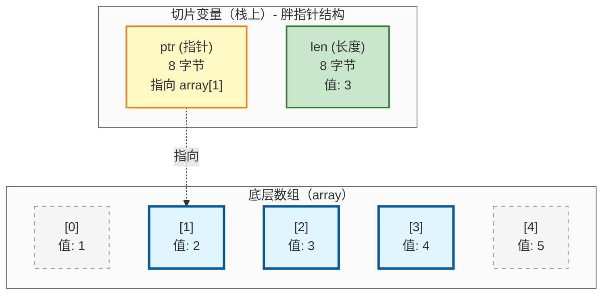

# 复合类型

本章介绍 Zig 中最常见的复合类型，包括数组、切片、枚举、联合、结构体和元组。它们用于把基础类型组织成更有结构的数据，是后续学习控制流、错误处理、内存管理和工程实践的基础。

> 💡 **阅读建议**
>
> 这一章的内容从“最常用的数据表示方式”逐步过渡到“更灵活的数据建模方式”。
> 如果你是第一次接触 Zig，建议优先掌握下面几部分：
> - 数组与切片
> - 结构体
> - 枚举
>
> 联合、非穷尽枚举以及部分与布局相关的内容，第一次阅读时可以先理解核心概念，不必急着记住所有细节。

## 数组

数组是固定大小的连续内存序列，其长度是编译期常量，也是类型的一部分。

### 基本用法

```zig
const std = @import("std");

pub fn main(_: std.process.Init) void {
    const array: [5]i32 = [_]i32{ 1, 2, 3, 4, 5 };

    const len = array.len;
    const first = array[0];
    const last = array[array.len - 1];

    for (array, 0..) |item, index| {
        std.debug.print("array[{}] = {}\n", .{ index, item });
    }

    std.debug.print("array length: {}, first: {}, last: {}\n", .{ len, first, last });

    const matrix: [3][3]i32 = [_][3]i32{
        [_]i32{ 1, 2, 3 },
        [_]i32{ 4, 5, 6 },
        [_]i32{ 7, 8, 9 },
    };
    for (matrix, 0..) |row, row_index| {
        for (row, 0..) |item, col_index| {
            std.debug.print("matrix[{}][{}] = {}\n", .{ row_index, col_index, item });
        }
    }
}
```

**预期输出：**
```
array[0] = 1
array[1] = 2
array[2] = 3
array[3] = 4
array[4] = 5
array length: 5, first: 1, last: 5
matrix[0][0] = 1
matrix[0][1] = 2
matrix[0][2] = 3
matrix[1][0] = 4
matrix[1][1] = 5
matrix[1][2] = 6
matrix[2][0] = 7
matrix[2][1] = 8
matrix[2][2] = 9
```

**核心特性**：

- **大小固定**：数组大小在编译期确定，不可改变
- **类型包含大小**：`[5]i32` 和 `[10]i32` 是不同的类型
- **值语义**：数组赋值会复制所有元素
- **内存连续**：元素在内存中连续存储，访问高效
- **边界检查**：数组长度是编译期常量，编译器可以在索引已知时提前发现越界；索引为运行时变量时仍进行运行时边界检查

> **相关章节**：数组遍历使用的 `for` 循环将在[控制流与资源管理](chapter-control-flow.md)中详细讲解。

### 数组操作

**初始化语法**：`[_]T{...}` 中的 `_` 表示让编译器从元素数量推断数组长度。

**连接（`++`）**：将两个编译期已知的数组连接为新数组。

**重复（`**`）**：将数组重复指定次数，生成新数组。

```zig
const std = @import("std");

pub fn main(_: std.process.Init) void {
    const part1 = [_]u8{ 1, 2, 3 };
    const part2 = [_]u8{ 4, 5 };

    const combined = part1 ++ part2;
    std.debug.print("连接: {any}\n", .{combined});

    const repeated = part1 ** 3;
    std.debug.print("重复: {any}\n", .{repeated});
}
```

**预期输出：**
```
连接: { 1, 2, 3, 4, 5 }
重复: { 1, 2, 3, 1, 2, 3, 1, 2, 3 }
```

`++` 和 `**` 都是编译期操作，操作数必须是编译期已知的值。

## 切片

切片是对连续内存区域的"视图"，包含指针和长度两个字段（胖指针）。切片本身大小固定（64 位系统上 16 字节），但可以在运行时引用不同长度的数据。

### 基本用法

```zig
const std = @import("std");

pub fn main(_: std.process.Init) void {
    var array = [_]i32{ 1, 2, 3, 4, 5 };

    const slice: []i32 = array[1..4];
    std.debug.print("slice length: {}, first: {}\n", .{ slice.len, slice[0] });

    slice[0] = 99;
    std.debug.print("array[1] after modification: {}\n", .{array[1]});

    const subslice = slice[0..2];
    std.debug.print("subslice length: {}\n", .{subslice.len});
}
```

**预期输出：**
```
slice length: 3, first: 2
array[1] after modification: 99
subslice length: 2
```

**核心特性**：

- **胖指针**：包含指针和长度两个字段（64 位系统上共 16 字节）
- **引用语义**：切片是对底层内存的引用，不拥有数据；修改切片会影响原数据
- **边界检查**：切片长度是运行时值，只能在运行时检查边界

> **深入学习**：胖指针是 Zig 指针系统的重要组成部分，[指针、切片与对齐](../part2-advanced/chapter-pointers.md)将详细讲解各种指针类型及其应用场景。

### 切片创建方式

| 方式 | 语法 | 说明 |
|------|------|------|
| 从数组切片 | `array[start..end]` | 包含 `start`，不包含 `end` |
| 全切片 | `array[:]` | 等价于 `array[0..array.len]` |
| 从指针切片 | `ptr[0..len]` | 从指针创建指定长度的切片 |
| 重新切片 | `slice[start..end]` | 从已有切片创建子切片 |

```zig
const std = @import("std");

pub fn main(_: std.process.Init) void {
    var array = [_]i32{ 1, 2, 3, 4, 5 };

    const full: []i32 = array[:];
    const sub: []i32 = array[1..4];
    const reslice: []i32 = sub[0..2];

    std.debug.print("full len: {}, sub len: {}, reslice len: {}\n", .{ full.len, sub.len, reslice.len });
}
```

**预期输出：**
```
full len: 5, sub len: 3, reslice len: 2
```

### 数组 vs 切片

| 特性 | 数组 | 切片 |
|------|------|------|
| **大小** | 编译期常量，类型的一部分 | 运行时值，存储在 `len` 字段中 |
| **内存** | 直接存储数据 | 胖指针（ptr + len，共 16 字节） |
| **语义** | 值语义（赋值复制） | 引用语义（赋值共享底层数据） |
| **边界检查** | 索引已知时编译期检查，否则运行时检查 | 运行时检查 |



**选择指南**：

| 场景 | 推荐使用 | 原因 |
|------|----------|------|
| 编译期已知大小 | 数组 | 性能更好，编译期检查 |
| 函数参数 | 切片 | 灵活，避免复制 |
| 返回值 | 切片 | 可以返回部分数据 |
| 全局常量 | 数组 | 存储在静态内存 |
| 动态大小 | 切片 | 唯一选择 |

## 哨兵终止数组

哨兵终止数组在数组末尾添加一个“哨兵值”来标记结束，主要用于 C 语言兼容性，以及需要明确终止标记的数据表示。

**语法**：
- `[N:S]T`：长度为 `N`、哨兵值为 `S`、元素类型为 `T` 的数组
- `[:S]T`：带哨兵值 `S` 的切片
- 最常见的：`[:0]const u8` —— 以 `0` 结尾的字节切片，常用于 C 风格字符串

```zig
const std = @import("std");

pub fn main(_: std.process.Init) void {
    const message: [5:0]u8 = "hello".*;

    std.debug.print("消息：{s}\n", .{&message});
    std.debug.print("长度（不含哨兵）：{}\n", .{message.len});
    std.debug.print("哨兵在索引 {} 处\n", .{message.len});

    for (message, 0..) |byte, index| {
        std.debug.print("[{}] = {c} ({})\n", .{ index, byte, byte });
    }

    const str: [:0]const u8 = &message;
    std.debug.print("哨兵终止切片长度：{}\n", .{str.len});
}
```

**注意事项**：
1. **哨兵值不在 `len` 中**：`message.len` 返回 5，但实际占用 6 字节
2. **访问哨兵**：`arr[arr.len]` 返回哨兵值
3. **编译期检查**：Zig 会确保哨兵值正确设置

| 特性 | 普通数组 `[N]T` | 哨兵数组 `[N:S]T` |
|------|-----------------|-------------------|
| 长度信息 | 编译期已知 | 编译期已知 |
| 内存布局 | N 个元素 | N+1 个元素（含哨兵） |
| C 兼容性 | 需要转换 | 直接兼容 |

**实际应用场景**：

```zig
extern "c" fn puts(s: [*:0]const u8) c_int;

pub fn callCFunction() void {
    const message = "Hello from Zig";
    _ = puts(message.ptr);
}
```

```zig
const std = @import("std");

pub fn main(_: std.process.Init) void {
    const names: [3][:0]const u8 = .{ "Alice", "Bob", "Charlie" };
    for (names, 0..) |name, i| {
        std.debug.print("名字 {}：{s}\n", .{ i, name });
    }
}
```

> **相关章节**：哨兵终止数组主要用于 C 互操作，详细内容请参考 [C 互操作](../part2-advanced/chapter-c-interop.md)。

## 枚举

枚举用于定义一组命名的整数值，提供类型安全和代码可读性。

**Zig 枚举的特点**：
- 可以指定底层整数类型
- 可以包含方法
- 与 C 枚举完全兼容
- switch 语句必须穷尽所有枚举值

### 基本枚举

```zig
const std = @import("std");

const Color = enum {
    red,
    green,
    blue,
};

pub fn main(_: std.process.Init) void {
    const color: Color = .red;

    const color_name = switch (color) {
        .red => "红色",
        .green => "绿色",
        .blue => "蓝色",
    };
    std.debug.print("颜色：{s}\n", .{color_name});

    std.debug.print("序值：{}\n", .{@intFromEnum(color)});

    const green_value: Color = @enumFromInt(1);
    std.debug.print("从整数创建：{}\n", .{green_value});
}
```

**预期输出：**
```
颜色：红色
序值：0
从整数创建：.green
```

> **相关章节**：枚举与 `switch` 语句配合使用时，编译器会强制穷尽性检查，详见[控制流与资源管理](chapter-control-flow.md)。

### 带整数类型的枚举

指定底层整数类型，用于 C 互操作、内存优化或协议兼容：

```zig
const std = @import("std");

const Priority = enum(u8) {
    low = 1,
    medium = 5,
    high = 10,
    critical = 20,
};

pub fn main(_: std.process.Init) void {
    const p: Priority = .high;
    std.debug.print("优先级：{s}，值：{}\n", .{ @tagName(p), @intFromEnum(p) });
}
```

**预期输出：**
```
优先级：high，值：10
```

### 枚举方法

```zig
const std = @import("std");

const Direction = enum(u4) {
    north = 0,
    east = 1,
    south = 2,
    west = 3,

    fn toString(self: Direction) []const u8 {
        return switch (self) {
            .north => "北",
            .east => "东",
            .south => "南",
            .west => "西",
        };
    }

    fn opposite(self: Direction) Direction {
        return switch (self) {
            .north => .south,
            .east => .west,
            .south => .north,
            .west => .east,
        };
    }

    fn allDirections() [4]Direction {
        return .{ .north, .east, .south, .west };
    }
};

pub fn main(_: std.process.Init) void {
    const dir: Direction = .north;
    std.debug.print("方向：{s}\n", .{dir.toString()});
    std.debug.print("相反方向：{s}\n", .{dir.opposite().toString()});

    const all = Direction.allDirections();
    std.debug.print("所有方向数量：{}\n", .{all.len});
}
```

**预期输出：**
```
方向：北
相反方向：南
所有方向数量：4
```

### 非穷尽枚举

非穷尽枚举使用 `_` 占位符表示未列出的值，适用于处理外部协议和 C 互操作时无法穷举所有可能值的场景：

```zig
const std = @import("std");

const TcpState = enum(u8) {
    closed = 0,
    listen = 1,
    established = 3,
    _, // 非穷尽：允许其他 u8 值
};

pub fn main(_: std.process.Init) void {
    const known: TcpState = .established;
    std.debug.print("已知状态：{s}\n", .{@tagName(known)});

    const unknown: TcpState = @enumFromInt(99);
    std.debug.print("未知状态值：{}\n", .{@intFromEnum(unknown)});

    switch (unknown) {
        .closed => std.debug.print("closed\n", .{}),
        .listen => std.debug.print("listen\n", .{}),
        .established => std.debug.print("established\n", .{}),
        _ => std.debug.print("其他状态\n", .{}),
    }
}
```

**预期输出：**
```
已知状态：established
未知状态值：99
其他状态
```

非穷尽枚举的 `switch` 必须使用 `_` 分支处理未命名的值。对非穷尽枚举而言，运行时才出现的未命名值不能按普通命名枚举值处理；在需要展示名称时，应该优先依赖显式分支或整数值，而不要假定所有值都一定有可用的标签名。

## 联合

联合允许在同一内存位置存储不同类型的数据。Zig 将联合分为两大类：

- **带标签联合**：有类型标签，自动跟踪活动成员，类型安全（推荐）
- **无标签联合**：无类型标签，需手动跟踪活动成员

### 带标签联合

带标签联合是联合和枚举的结合体，通过标签自动跟踪当前存储的值类型。这是 Zig 中实现安全多态的核心机制。

**基本用法**：

```zig
const std = @import("std");

const Shape = union(enum) {
    circle: struct { radius: f32 },
    rectangle: struct { width: f32, height: f32 },
    triangle: struct { base: f32, height: f32 },

    fn area(self: Shape) f32 {
        return switch (self) {
            .circle => |c| std.math.pi * c.radius * c.radius,
            .rectangle => |r| r.width * r.height,
            .triangle => |t| t.base * t.height * 0.5,
        };
    }
};

pub fn main(_: std.process.Init) void {
    const shapes: [3]Shape = .{
        Shape{ .circle = .{ .radius = 1.0 } },
        Shape{ .rectangle = .{ .width = 3.0, .height = 5.0 } },
        Shape{ .triangle = .{ .base = 6.0, .height = 4.0 } },
    };

    for (shapes, 0..) |shape, i| {
        std.debug.print("形状 {} 面积：{:.2}\n", .{ i, shape.area() });
    }
}
```

**预期输出：**
```
形状 0 面积：3.14
形状 1 面积：15.00
形状 2 面积：12.00
```

**两种定义方式**：

方式一（匿名标记，推荐）：使用 `union(enum)`，编译器自动生成枚举标签。

方式二（显式标签）：先定义枚举类型，再定义联合引用它：

```zig
const ShapeTag = enum { circle, rectangle };
const Shape = union(ShapeTag) {
    circle: struct { radius: f32 },
    rectangle: struct { width: f32, height: f32 },
};
```

**带标签联合的方法**：

```zig
const std = @import("std");

const Value = union(enum) {
    integer: i64,
    float: f64,
    boolean: bool,
    string: []const u8,

    fn describe(self: Value) []const u8 {
        return switch (self) {
            .integer => "整数",
            .float => "浮点数",
            .boolean => "布尔值",
            .string => "字符串",
        };
    }

    fn toInt(self: Value) ?i64 {
        return switch (self) {
            .integer => |v| v,
            .float => |v| @intFromFloat(v),
            .boolean => |v| if (v) 1 else 0,
            .string => null,
        };
    }
};

pub fn main(_: std.process.Init) void {
    const values: [4]Value = .{
        Value{ .integer = 42 },
        Value{ .float = 3.14 },
        Value{ .boolean = true },
        Value{ .string = "hello" },
    };

    for (values) |val| {
        std.debug.print("{s} = ", .{val.describe()});
        switch (val) {
            .integer => |v| std.debug.print("{}\n", .{v}),
            .float => |v| std.debug.print("{}\n", .{v}),
            .boolean => |v| std.debug.print("{}\n", .{v}),
            .string => |v| std.debug.print("{s}\n", .{v}),
        }
    }
}
```

**预期输出：**
```
整数 = 42
浮点数 = 3.14
布尔值 = true
字符串 = hello
```

> **相关章节**：带标签联合与 `switch` 语句配合使用时，编译器会自动推断活动变体，详见[控制流与资源管理](chapter-control-flow.md)。

### 无标签联合

无标签联合没有类型标签，程序员需要自己跟踪当前活动的成员。根据内存布局的不同，分为三种：

| 类型 | 内存布局 | 访问非活动成员 | 主要用途 |
|------|----------|----------------|----------|
| **普通 union** | 由编译器决定 | 安全模式下触发运行时错误 | 通用场景 |
| **extern union** | C ABI | 允许 | C 互操作、类型转换 |
| **packed union** | 位级精确 | 允许 | 硬件编程、位操作 |

**普通 union**：

```zig
const std = @import("std");

const Data = union {
    as_i32: i32,
    as_f32: f32,
    as_bytes: [4]u8,
};

pub fn main(_: std.process.Init) void {
    var data: Data = .{ .as_i32 = 42 };
    std.debug.print("as_i32: {}\n", .{data.as_i32});

    data = .{ .as_f32 = 3.14 };
    std.debug.print("as_f32: {}\n", .{data.as_f32});

    std.debug.print("联合大小: {} 字节\n", .{@sizeOf(Data)});
}
```

**预期输出：**
```
as_i32: 42
as_f32: 3.14
联合大小: 8 字节
```

注意：虽然所有成员都是 4 字节，但普通 union 的大小不一定等于最大成员的大小。普通 union 的内存布局由编译器决定，实际大小取决于编译器实现。访问非活动成员在安全构建模式下会触发运行时错误，在 ReleaseFast/ReleaseSmall 模式下是未定义行为。

**extern union**：

`extern union` 遵循 C ABI，允许访问非活动成员（类型重解释）：

```zig
const std = @import("std");

const Data = extern union {
    as_i32: i32,
    as_f32: f32,
    as_bytes: [4]u8,
};

pub fn main(_: std.process.Init) void {
    const data: Data = .{ .as_i32 = 0x41424344 };

    std.debug.print("as_i32: {}\n", .{data.as_i32});
    std.debug.print("as_f32: {}\n", .{data.as_f32});
    std.debug.print("as_bytes: {s}\n", .{data.as_bytes});
    std.debug.print("联合大小: {} 字节\n", .{@sizeOf(Data)});
}
```

**预期输出（小端序平台，如 x86/ARM）：**
```
as_i32: 1094861636
as_f32: 12.141422
as_bytes: DCBA
联合大小: 4 字节
```

注意：`as_bytes` 的输出取决于 CPU 字节序。上例为小端序结果，大端序平台上输出不同。

**packed union**：

`packed union` 有位级精确的内存布局，所有成员必须有相同的 `@bitSizeOf`，可以嵌入 `packed struct` 中：

```zig
const std = @import("std");

const Data = packed union {
    as_u32: u32,
    as_i32: i32,
    as_f32: f32,
};

pub fn main(_: std.process.Init) void {
    const data: Data = .{ .as_u32 = 0x40490FDB };
    std.debug.print("as_u32: 0x{X}\n", .{data.as_u32});
    std.debug.print("as_f32: {}\n", .{data.as_f32});
}
```

`packed union` 支持指定 backing integer type：

```zig
const Register = packed struct {
    control: packed union(u32) {
        as_u32: u32,
        bits: packed struct {
            enable: u1,
            mode: u3,
            reserved: u28,
        },
    },
    status: u32,
};
```

### 高级特性

**`@unionInit`**：内建函数，用于在字段名为编译期参数时初始化联合。其字段名参数必须是编译期常量，但函数本身可以在运行时使用。

```zig
const std = @import("std");

const MyUnion = union {
    int: i32,
    float: f64,
    string: []const u8,
};

pub fn main(_: std.process.Init) void {
    const u1 = MyUnion{ .int = 42 };
    const u2 = @unionInit(MyUnion, "float", 3.14);
    const u3 = @unionInit(MyUnion, "string", "hello");

    std.debug.print("u1: {}\n", .{u1.int});
    std.debug.print("u2: {}\n", .{u2.float});
    std.debug.print("u3: {s}\n", .{u3.string});
}
```

`@unionInit` 的主要用途是在泛型代码中，当字段名是 `comptime` 参数时无法使用普通初始化语法：

```zig
fn initUnion(comptime field: []const u8, value: anytype) MyUnion {
    return @unionInit(MyUnion, field, value);
}
```

> **相关章节**：更多编译期技巧请参考[编译期计算与元编程](../part2-advanced/chapter-comptime.md)和[泛型编程](../part2-advanced/chapter-generics.md)。

**`@tagName`**：获取带标签联合当前变体的名称字符串，常用于日志和调试：

```zig
const std = @import("std");

const Result = union(enum) {
    success: i32,
    failure: []const u8,
};

pub fn main(_: std.process.Init) void {
    const r1 = Result{ .success = 100 };
    const r2 = Result{ .failure = "连接失败" };

    std.debug.print("r1 标签: {s}\n", .{@tagName(r1)});
    std.debug.print("r2 标签: {s}\n", .{@tagName(r2)});

    switch (r1) {
        .success => |value| std.debug.print("成功: {}\n", .{value}),
        .failure => |msg| std.debug.print("失败: {s}\n", .{msg}),
    }
}
```

**预期输出：**
```
r1 标签: success
r2 标签: failure
成功: 100
```

## 结构体

结构体是 Zig 中定义复合类型的主要方式，将多个相关的数据字段组合成一个逻辑单元。

### 基本用法

```zig
const std = @import("std");

const Rectangle = struct {
    width: f32,
    height: f32,

    fn area(self: Rectangle) f32 {
        return self.width * self.height;
    }

    fn scale(self: *Rectangle, factor: f32) void {
        self.width *= factor;
        self.height *= factor;
    }

    fn square(size: f32) Rectangle {
        return Rectangle{
            .width = size,
            .height = size,
        };
    }
};

pub fn main(_: std.process.Init) void {
    var rect = Rectangle{
        .width = 10.0,
        .height = 5.0,
    };

    std.debug.print("面积: {d:.2}\n", .{rect.area()});

    rect.scale(2.0);
    std.debug.print("放大后面积: {d:.2}\n", .{rect.area()});

    const sq = Rectangle.square(4.0);
    std.debug.print("正方形面积: {d:.2}\n", .{sq.area()});
}
```

**预期输出：**
```
面积: 50.00
放大后面积: 200.00
正方形面积: 16.00
```

**核心概念**：

- **字段**：存储数据的变量，可以有默认值。字段的可变性取决于结构体实例是否为 `var`：`var` 实例的字段可修改，`const` 实例的字段不可修改
- **方法**：带有 `self` 参数的函数（值类型 `self` 不能修改字段，指针类型 `*Self` 可以修改）
- **关联函数**：不带 `self` 参数的函数（类似静态方法/构造函数）

```zig
var p = Point{ .x = 1.0, .y = 2.0 };
p.x = 3.0;  // 合法：p 是 var

const q = Point{ .x = 1.0, .y = 2.0 };
// q.x = 3.0;  // 编译错误：q 是 const
```

### 结构体布局

Zig 提供三种布局方式：

| 布局方式 | 使用场景 | 特点 |
|----------|----------|------|
| 默认 | 大多数情况 | 编译器可重排字段优化布局 |
| packed | 位操作、协议解析 | 紧凑存储，无填充，位级精确 |
| extern | 与 C 互操作 | 遵循 C ABI，按声明顺序排列 |

```zig
const std = @import("std");

const AutoLayout = struct {
    a: u8,
    b: u32,
    c: u16,
};

const PackedStruct = packed struct {
    a: u8,
    b: u32,
    c: u16,
};

const ExternStruct = extern struct {
    a: u8,
    b: u32,
    c: u16,
};

pub fn main(_: std.process.Init) void {
    std.debug.print("AutoLayout 大小: {} 字节\n", .{@sizeOf(AutoLayout)});
    std.debug.print("PackedStruct 大小: {} 字节\n", .{@sizeOf(PackedStruct)});
    std.debug.print("ExternStruct 大小: {} 字节\n", .{@sizeOf(ExternStruct)});
}
```

**预期输出：**
```
AutoLayout 大小: 8 字节
PackedStruct 大小: 8 字节
ExternStruct 大小: 12 字节
```

**`packed struct` 详解**：

- 字段按声明顺序紧密排列，无 padding
- 不允许自定义字段对齐（`align` 修饰符无效）
- `@bitSizeOf(T)` 返回所有字段位宽之和，`@sizeOf(T)` 返回实际占用字节数（需满足整体对齐要求）
- 可以嵌入 `packed union`，但不能嵌入 `extern union`

```zig
const std = @import("std");

const Flags = packed struct {
    enable: bool,
    mode: u3,
    priority: u2,
    reserved: u2,

    pub fn asByte(self: Flags) u8 {
        return @bitCast(self);
    }
};

pub fn main(_: std.process.Init) void {
    const flags = Flags{ .enable = true, .mode = 0b101, .priority = 0b11, .reserved = 0 };
    std.debug.print("bitSizeOf: {}, sizeOf: {}\n", .{ @bitSizeOf(Flags), @sizeOf(Flags) });
    std.debug.print("as byte: 0x{X}\n", .{flags.asByte()});
}
```

**预期输出：**
```
bitSizeOf: 8, sizeOf: 1
as byte: 0xED
```

### 结果位置语义

当目标类型已知时，可以省略匿名结构体的类型名：

```zig
const std = @import("std");

const Point = struct {
    x: f32,
    y: f32,
};

fn printPoint(p: Point) void {
    std.debug.print("Point({}, {})\n", .{ p.x, p.y });
}

pub fn main(_: std.process.Init) void {
    const p: Point = .{ .x = 1.0, .y = 2.0 };
    printPoint(p);

    printPoint(.{ .x = 3.0, .y = 4.0 });
}
```

**预期输出：**
```
Point(1, 2)
Point(3, 4)
```

适用场景：变量声明（类型注解提供结果位置）、函数参数（函数签名提供结果位置）、返回值（返回类型提供结果位置）。类型必须明确，否则编译错误。

### 字段默认值

```zig
const std = @import("std");

const Config = struct {
    host: []const u8 = "localhost",
    port: u16 = 8080,
    timeout: u32 = 30,
    debug: bool = false,
};

const Threshold = struct {
    minimum: f32,
    maximum: f32,

    const default: Threshold = .{
        .minimum = 0.25,
        .maximum = 0.75,
    };
};

pub fn main(_: std.process.Init) void {
    const cfg = Config{ .host = "example.com" };
    std.debug.print("配置: {s}:{}\n", .{ cfg.host, cfg.port });

    const threshold: Threshold = .default;
    std.debug.print("阈值范围: {} - {}\n", .{ threshold.minimum, threshold.maximum });
}
```

**预期输出：**
```
配置: example.com:8080
阈值范围: 0.25 - 0.75
```

默认值必须是编译期常量。没有默认值的字段必须显式提供。`Threshold.default` 使用了 decl literal 语法（`.default`），编译器根据结果位置类型自动解析为 `Threshold.default`。

### 泛型结构体

Zig 通过 `comptime` 参数实现泛型结构体：

```zig
const std = @import("std");

fn Vector(comptime T: type) type {
    return struct {
        x: T,
        y: T,
        z: T,

        const Self = @This();

        fn add(self: Self, other: Self) Self {
            return .{
                .x = self.x + other.x,
                .y = self.y + other.y,
                .z = self.z + other.z,
            };
        }
    };
}

pub fn main(_: std.process.Init) void {
    const Vec3f = Vector(f32);
    const v1 = Vec3f{ .x = 1.0, .y = 2.0, .z = 3.0 };
    const v2 = Vec3f{ .x = 4.0, .y = 5.0, .z = 6.0 };

    const v3 = v1.add(v2);
    std.debug.print("v1 + v2 = ({d:.1}, {d:.1}, {d:.1})\n", .{ v3.x, v3.y, v3.z });
}
```

**预期输出：**
```
v1 + v2 = (5.0, 7.0, 9.0)
```

`@This()` 获取当前正在定义的类型，常用于泛型结构体中引用自身类型。

> **深入学习**：泛型结构体的完整实现和高级用法请参考[泛型编程](../part2-advanced/chapter-generics.md)章节。

## 元组

元组是一种特殊的匿名结构体，字段没有名称，使用数字索引访问。元组可以包含不同类型的元素。

### 基本用法

```zig
const std = @import("std");

pub fn main(_: std.process.Init) void {
    const tuple = .{ 1, "hello", 3.14, true };

    std.debug.print("第一个元素: {}\n", .{tuple[0]});
    std.debug.print("第二个元素: {s}\n", .{tuple[1]});
    std.debug.print("元组长度: {}\n", .{tuple.len});

    inline for (tuple, 0..) |item, index| {
        std.debug.print("tuple[{}] = {any}\n", .{ index, item });
    }
}
```

**预期输出：**
```
第一个元素: 1
第二个元素: hello
元组长度: 4
tuple[0] = 1
tuple[1] = { 104, 101, 108, 108, 111 }
tuple[2] = 3.14
tuple[3] = true
```

遍历元组必须使用 `inline for`，因为每个元素的类型可能不同，编译器需要在编译期为每个元素生成对应的代码。

### 元组操作

**元组连接**：使用 `++` 连接两个元组。

**元组与结构体的关系**：元组本质上是无字段名的匿名结构体，字段名为数字索引（0, 1, 2...）。

```zig
const std = @import("std");

pub fn main(_: std.process.Init) void {
    const t1 = .{ 1, 2 };
    const t2 = .{ "a", "b" };
    const combined = t1 ++ t2;
    std.debug.print("连接后长度: {}\n", .{combined.len});
    std.debug.print("combined[2]: {s}\n", .{combined[2]});

    const TupleType = @TypeOf(combined);
    std.debug.print("类型: {}\n", .{TupleType});
}
```

**预期输出：**
```
连接后长度: 4
combined[2]: a
类型: struct { comptime comptime_int = 1, comptime comptime_int = 2, comptime *const [2:0]u8 = "a", comptime *const [2:0]u8 = "b" }
```

| 特性 | 元组 | 结构体 | 数组 |
|------|------|--------|------|
| 字段访问 | 索引（0, 1, 2...） | 名称 | 索引 |
| 元素类型 | 可以不同 | 可以不同 | 必须相同 |
| 定义方式 | 匿名 | 命名类型 | 命名类型 |
| 适用场景 | 临时数据、多返回值 | 长期存储、复用 | 同类数据集合 |
