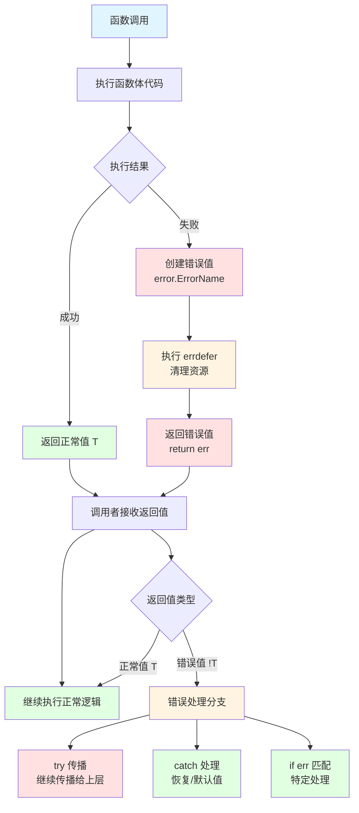

# 【draft】错误处理基础

错误处理是系统编程的核心课题之一。与许多语言使用异常（exception）或可选值（option）不同，Zig 采用了一套独特的错误处理机制，将错误作为语言的一等公民，通过**错误集合（Error Set）**和**错误联合类型（Error Union）**实现显式、零开销的错误处理。

Zig 错误处理的核心设计理念：

- **显式优于隐式**：函数签名必须声明可能返回的错误，调用者无法忽略错误
- **零开销**：错误类型在编译时确定，不引入运行时额外开销（如异常表、栈展开）
- **组合性**：错误集合可以合并、子集化，灵活应对不同层级的错误抽象需求
- **与 `try`/`catch` 配合**：提供简洁的错误传播和处理语法，同时保持控制流清晰可读

本章将介绍 Zig 错误处理的基础概念，包括错误集合定义、错误联合类型、`try`/`catch` 语法、`errdefer` 资源清理，以及错误处理的最佳实践。

# 为什么Zig不用异常？

Zig选择显式错误处理而非异常机制，原因如下：

1. **可预测性**: 控制流清晰可见，没有隐藏的跳转
2. **性能**: 无异常处理开销，错误处理代码只在需要时执行
3. **可读性**: 函数签名明确声明可能返回的错误
4. **可调试性**: 错误追踪完整，易于定位问题根源

## 错误集合

错误集合（Error Set）是 Zig 中定义错误类型的方式。

### 定义错误集合

```zig
const std = @import("std");

// 定义错误集合
const FileError = error{
    NotFound,
    PermissionDenied,
    OutOfMemory,
};

const NetworkError = error{
    ConnectionFailed,
    Timeout,
};

pub fn main(init: std.process.Init.Minimal) void {
    const err: FileError = FileError.NotFound;
    
    // 错误比较
    if (err == FileError.NotFound) {
        std.debug.print("文件未找到\n", .{});
    }
}
```

**实际应用：配置文件错误集**

```zig
// 为配置文件解析定义专门的错误集
const ConfigError = error{
    FileNotFound,
    InvalidSyntax,
    MissingRequiredField,
    InvalidValue,
    EncodingError,
};

// 使用示例
fn loadConfig(path: []const u8) ConfigError!Config {
    const file = std.fs.cwd().openFile(path, .{}) catch {
        return error.FileNotFound;
    };
    defer file.close();
    
    // 解析配置文件...
    return Config{};
}
```

### 错误集推断

Zig 会自动推断函数的错误集：

```zig
const std = @import("std");

// Zig 会自动推断错误集
fn doSomething() !void {
    // 错误集被推断为 error{FileNotFound, OutOfMemory}
    const file = try std.fs.cwd().openFile("test.txt", .{});
    defer file.close();
    
    var gpa: std.heap.DebugAllocator(.{}) = .init;
    const allocator = gpa.allocator();
    const buffer = try allocator.alloc(u8, 1024);
    defer allocator.free(buffer);
}
```

### 错误集合并

使用 `||` 操作符合并错误集：

```zig
const FileError = error{
    NotFound,
    PermissionDenied,
};

const NetworkError = error{
    ConnectionFailed,
    Timeout,
};

// 合并错误集
const CombinedError = FileError || NetworkError;

// 子集关系
const SpecificError = error{NotFound};
// SpecificError 是 FileError 的子集，可以隐式转换
```

### 错误集转换

在不同错误集之间转换：

```zig
// 自动转换（子集到超集）
fn convertError(err: FileError) CombinedError {
    return err;  // 自动转换
}

// 手动映射
fn mapError(err: FileError) NetworkError!void {
    return switch (err) {
        error.NotFound => error.ConnectionFailed,
        error.PermissionDenied => error.Timeout,
    };
}
```

### anyerror 的使用

`anyerror` 是所有可能错误的超集：

```zig
// 使用场景：
// 1. 原型开发阶段
// 2. 不确定具体错误类型时
// 3. 与 C 代码交互时

// 注意事项：
// 1. 会增加二进制大小
// 2. 降低类型安全性
// 3. 应该在生产代码中避免使用

fn flexibleFunction() anyerror!void {
    // 可以返回任何错误
}
```

## 错误联合类型

错误联合类型（Error Union）表示可能返回错误或正常值的类型。

### 基本语法

```zig
const std = @import("std");

const ParseError = error{
    InvalidFormat,
    OutOfRange,
};

// 错误联合类型：可能返回 i32 或 ParseError
fn parseNumber(str: []const u8) ParseError!i32 {
    if (str.len == 0) return ParseError.InvalidFormat;
    
    var result: i32 = 0;
    for (str) |char| {
        if (char < '0' or char > '9') return ParseError.InvalidFormat;
        result = result * 10 + (char - '0');
    }
    
    return result;
}

pub fn main(init: std.process.Init.Minimal) !void {
    // 使用 try 传递错误
    const num1 = try parseNumber("123");
    std.debug.print("解析结果：{}\n", .{num1});
    
    // 使用 catch 处理错误
    const num2 = parseNumber("abc") catch |err| {
        std.debug.print("解析失败：{}\n", .{err});
        return;
    };
    std.debug.print("解析结果：{}\n", .{num2});
}
```

### 内存表示

错误联合类型在内存中的表示取决于类型大小：

```zig
// 小类型：使用标记位
// 例如：!i32 使用一个额外的标记位来区分错误和正常值

// 大类型：使用联合体
// 例如：!LargeStruct 使用联合体来存储错误或结构体
```

### 性能特性

- **成功路径**：零开销（无额外检查）
- **错误路径**：有少量开销（错误值传递）
- **与异常比较**：无栈展开开销，无异常表

## try 和 catch

`try` 和 `catch` 是 Zig 错误处理的核心语法。

### try：错误传播

`try` 用于将错误传播给调用者：

```zig
const std = @import("std");

fn readConfig(path: []const u8) ![]u8 {
    const file = try std.fs.cwd().openFile(path, .{});  // 错误传播
    defer file.close();
    
    var buffer: [1024]u8 = undefined;
    const bytes = try file.read(std.io.getStdOut().writer().context, &buffer);
    return buffer[0..bytes];
}
```

### catch：错误处理

`catch` 用于在当前层级处理错误：

```zig
const std = @import("std");

fn mayFail() !i32 {
    return error.SomethingWrong;
}

pub fn main(init: std.process.Init.Minimal) !void {
    // 基本用法：提供默认值
    const result1 = mayFail() catch 0;
    std.debug.print("结果 1: {}\n", .{result1});
    
    // 获取错误值
    const result2 = mayFail() catch |err| {
        std.debug.print("捕获错误：{}\n", .{err});
        return;
    };
    
    // 成功和失败分别处理
    const result3 = mayFail() catch |err| {
        std.debug.print("错误：{}\n", .{err});
        return;
    } else |value| {
        std.debug.print("成功：{}\n", .{value});
    };
}
```

### 错误匹配

使用 `switch` 匹配不同的错误类型：

```zig
const std = @import("std");

const FileError = error{
    NotFound,
    PermissionDenied,
    DiskFull,
};

fn saveData(path: []const u8, data: []const u8) FileError!void {
    if (std.mem.eql(u8, path, "/forbidden")) {
        return error.PermissionDenied;
    }
    if (std.mem.eql(u8, path, "/disk_full")) {
        return error.DiskFull;
    }
    if (std.mem.eql(u8, path, "/missing")) {
        return error.NotFound;
    }
}

pub fn main(init: std.process.Init.Minimal) void {
    saveData("/forbidden", "data") catch |err| switch (err) {
        error.NotFound => std.debug.print("文件未找到，创建新文件\n", .{}),
        error.PermissionDenied => std.debug.print("权限不足，请求管理员权限\n", .{}),
        error.DiskFull => std.debug.print("磁盘已满，清理空间\n", .{}),
    };
}
```

## errdefer

`errdefer` 用于在函数返回错误时执行清理操作。

### 基本用法

```zig
const std = @import("std");

fn allocateAndProcess(allocator: std.mem.Allocator) !void {
    const memory = try allocator.alloc(u8, 100);
    
    // 如果函数返回错误，释放内存
    errdefer allocator.free(memory);
    
    // 可能失败的操作
    const success = false;
    if (!success) {
        return error.ProcessingFailed;  // errdefer 会执行
    }
    
    // 成功时的清理
    allocator.free(memory);
}
```

### 多资源管理

```zig
const std = @import("std");

fn processFile(allocator: std.mem.Allocator, path: []const u8) !void {
    // 资源获取顺序：按依赖关系获取
    const file = try std.fs.cwd().openFile(path, .{});
    errdefer file.close();  // 出错时关闭文件
    
    const buffer = try allocator.alloc(u8, 1024);
    errdefer allocator.free(buffer);  // 出错时释放内存
    
    // 处理内容
    var buf: [1024]u8 = undefined;
    const bytes_read = try file.read(std.io.getStdOut().writer().context, &buf);
    try processContent(buf[0..bytes_read]);
    
    // 成功时的清理（按相反顺序）
    allocator.free(buffer);
    file.close();
}

fn processContent(content: []const u8) !void {
    if (content.len == 0) {
        return error.EmptyContent;
    }
    std.debug.print("处理内容：{s}\n", .{content});
}
```

**实际应用：数据库连接池**

```zig
const std = @import("std");

// 简化的数据库连接池示例
const ConnectionPool = struct {
    connections: []*Connection,
    allocator: std.mem.Allocator,
    
    fn acquire(self: *ConnectionPool) !*Connection {
        // 尝试获取空闲连接
        for (self.connections) |conn| {
            if (!conn.in_use) {
                conn.in_use = true;
                return conn;
            }
        }
        return error.NoAvailableConnection;
    }
    
    fn release(self: *ConnectionPool, conn: *Connection) void {
        conn.in_use = false;
    }
};

const Connection = struct {
    id: usize,
    in_use: bool = false,
};

// 使用 errdefer 管理连接
fn queryUser(pool: *ConnectionPool, user_id: usize) !UserData {
    const conn = try pool.acquire();
    errdefer pool.release(conn);  // 出错时归还连接
    
    // 执行查询...
    if (user_id == 0) {
        return error.InvalidUserId;
    }
    
    const user_data = UserData{ .id = user_id, .name = "test" };
    
    pool.release(conn);  // 成功时手动归还
    return user_data;
}

const UserData = struct {
    id: usize,
    name: []const u8,
};
```

### 执行顺序

多个 `errdefer` 按相反顺序执行（LIFO - 后进先出）：

```zig
fn example() !void {
    const resource1 = try acquire1();
    errdefer release1(resource1);  // 第 3 个执行
    
    const resource2 = try acquire2();
    errdefer release2(resource2);  // 第 2 个执行
    
    const resource3 = try acquire3();
    errdefer release3(resource3);  // 第 1 个执行
    
    // 如果出错，执行顺序：release3 → release2 → release1
}
```

# 错误处理流程

## 流程图

**完整错误处理流程**：



**错误处理关键节点**：

| 节点         | 作用                     | 示例                             |
| ------------ | ------------------------ | -------------------------------- |
| **错误创建** | 定义错误类型并创建错误值 | `return error.FileNotFound;`     |
| **errdefer** | 确保错误发生时资源被清理 | `errdefer file.close();`         |
| **错误传播** | 将错误传递给上层调用者   | `try openFile(path);`            |
| **错误捕获** | 在当前层级处理错误       | `catch { return default; }`      |
| **错误匹配** | 根据错误类型执行不同逻辑 | `if (err == error.NotFound) ...` |

## 完整示例

```zig
const std = @import("std");

fn processFile(allocator: std.mem.Allocator, path: []const u8) !void {
    const file = try std.fs.cwd().openFile(path, .{});
    errdefer file.close();
    
    const buffer = try allocator.alloc(u8, 1024);
    errdefer allocator.free(buffer);
    
    var buf: [1024]u8 = undefined;
    const bytes_read = try file.read(std.io.getStdOut().writer().context, &buf);
    
    if (bytes_read == 0) {
        return error.EmptyFile;
    }
    
    std.debug.print("读取到 {} 字节\n", .{bytes_read});
    
    allocator.free(buffer);
    file.close();
}

pub fn main(init: std.process.Init.Minimal) !void {
    var gpa: std.heap.DebugAllocator(.{}) = .init;
    defer _ = gpa.deinit();
    const allocator = gpa.allocator();
    
    processFile(allocator, "data.txt") catch |err| {
        std.debug.print("处理失败: {}\n", .{err});
        return err;
    };
    
    std.debug.print("处理成功\n", .{});
}
```

# 高级主题

## 错误集推断详解

Zig 编译器会自动推断函数的错误集：

```zig
const std = @import("std");

// 显式声明错误集
fn explicitErrors() error{ FileNotFound, OutOfMemory }!void {
    const file = try std.fs.cwd().openFile("test.txt", .{});
    defer file.close();
    
    var gpa: std.heap.DebugAllocator(.{}) = .init;
    const allocator = gpa.allocator();
    const buffer = try allocator.alloc(u8, 1024);
    defer allocator.free(buffer);
}

// 让编译器推断错误集
fn inferredErrors() !void {
    const file = try std.fs.cwd().openFile("test.txt", .{});
    defer file.close();
    
    var gpa: std.heap.DebugAllocator(.{}) = .init;
    const allocator = gpa.allocator();
    const buffer = try allocator.alloc(u8, 1024);
    defer allocator.free(buffer);
    
    // 编译器会推断出与 explicitErrors 相同的错误集
}
```

## 错误集合并详解

错误集可以合并和子集化：

```zig
const std = @import("std");

const FileError = error{
    NotFound,
    PermissionDenied,
};

const NetworkError = error{
    ConnectionFailed,
    Timeout,
};

// 合并错误集
const CombinedError = FileError || NetworkError;

// 子集关系
const SpecificError = error{NotFound};

fn example() void {
    const specific: SpecificError = error.NotFound;
    
    // 子集可以隐式转换为超集
    const file: FileError = specific;
    const combined: CombinedError = specific;
    
    // 但超集不能隐式转换为子集
    // const back: SpecificError = file;  // 编译错误
}
```

## 错误集转换详解

在不同错误集之间转换：

```zig
const std = @import("std");

const LowLevelError = error{
    DiskError,
    NetworkError,
};

const HighLevelError = error{
    IOError,
    Timeout,
};

// 错误映射
fn mapError(err: LowLevelError) HighLevelError {
    return switch (err) {
        error.DiskError => error.IOError,
        error.NetworkError => error.Timeout,
    };
}

// 使用示例
fn highLevelOperation() HighLevelError!void {
    const result = lowLevelOperation() catch |err| {
        return mapError(err);
    };
}

fn lowLevelOperation() LowLevelError!void {
    return error.DiskError;
}
```

## 性能考虑

### 内存布局

```zig
// 小类型：使用标记位
// !i32 在内存中占用 4 字节 + 标记位
// 标记位用于区分错误和正常值

// 大类型：使用联合体
// !LargeStruct 在内存中占用 max(sizeof(Error), sizeof(LargeStruct))
```

### 性能特性

- **成功路径**：零开销（无额外检查）
- **错误路径**：有少量开销（错误值传递）
- **与异常比较**：
  - 无栈展开开销
  - 无异常表
  - 无隐藏的控制流

### 最佳实践

1. **优先使用具体错误集**：避免 `anyerror`
2. **合理使用错误集推断**：让编译器推断错误集
3. **避免过度嵌套**：深层嵌套的错误处理会影响性能

# 最佳实践

## 定义清晰的错误类型

```zig
// ✅ 好的做法：语义化的错误名称
const ConfigError = error{
    FileNotFound,
    InvalidFormat,
    MissingRequiredField,
    ValueOutOfRange,
};

// ❌ 不好的做法：模糊的错误名称
const Error = error{
    Failed,
    Error,
    Bad,
};
```

## 错误传播策略

```zig
// 策略1：使用 try 传播错误（让调用者处理）
fn readConfig(path: []const u8) !Config {
    const file = try std.fs.cwd().openFile(path, .{});
    defer file.close();
    // ...
}

// 策略2：使用 catch 处理错误（当前层级处理）
fn readConfigOrDefault(path: []const u8) Config {
    return readConfig(path) catch {
        return Config.default();
    };
}

// 策略3：错误转换（统一错误类型）
fn readConfigUnified(path: []const u8) UnifiedError!Config {
    return readConfig(path) catch |err| switch (err) {
        error.FileNotFound => UnifiedError.NotFound,
        else => UnifiedError.IOError,
    };
}
```

## 资源管理

```zig
fn processFile(path: []const u8, allocator: std.mem.Allocator) !void {
    const file = try std.fs.cwd().openFile(path, .{});
    errdefer file.close();  // 出错时关闭文件
    
    const buffer = try allocator.alloc(u8, 1024);
    errdefer allocator.free(buffer);  // 出错时释放内存
    
    try processContent(buffer);
    
    // 成功时手动清理
    allocator.free(buffer);
    file.close();
}
```

## 错误处理模式

### 模式1：带默认值

```zig
const value = mightFail() catch 0;
```

### 模式2：带日志

```zig
const value = mightFail() catch |err| {
    std.log.err("操作失败: {}", .{err});
    return err;
};
```

### 模式3：多错误类型

```zig
const value = mightFailMultiple() catch |err| switch (err) {
    error.NetworkError => handleNetworkError(err),
    error.Timeout => retry(),
    else => return err,
};
```

# 常见错误与调试

## 常见编译错误

### 错误1：类型不匹配

```zig
// ❌ 错误示例
fn foo(x: i32) void { _ = x; }
foo(42.0);  // 错误：期望 i32，找到 comptime_float

// ✅ 正确做法
foo(@as(i32, 42));
```

### 错误2：错误集不兼容

```zig
// ❌ 错误示例
const SpecificError = error{NotFound};
const BroadError = error{NotFound, PermissionDenied};

fn narrow() SpecificError!void {
    return error.NotFound;
}

fn broad() BroadError!void {
    return narrow();  // 错误：错误集不兼容
}

// ✅ 正确做法
fn broad() BroadError!void {
    return narrow() catch |err| {
        return @errorCast(err);
    };
}
```

## 常见运行时错误

### 错误1：未处理的错误

```zig
// ❌ 错误示例
fn main() void {
    mightFail();  // 错误：未处理可能的错误
}

// ✅ 正确做法
fn main() !void {
    try mightFail();
}
```

### 错误2：错误的 errdefer 使用

```zig
// ❌ 错误示例
fn example() !void {
    const resource = try acquire();
    errdefer release(resource);
    
    // 错误：在成功路径上也执行了 errdefer
    return;  // errdefer 会执行，但资源已经被释放
}

// ✅ 正确做法
fn example() !void {
    const resource = try acquire();
    errdefer release(resource);
    
    // 成功时手动清理
    release(resource);
}
```

## 调试技巧

### 技巧1：打印错误信息

```zig
const std = @import("std");

pub fn main(init: std.process.Init.Minimal) void {
    const result = riskyOperation() catch |err| {
        std.debug.print("错误: {}\n", .{err});
        return;
    };
    std.debug.print("成功: {}\n", .{result});
}
```

### 技巧2：打印堆栈追踪

```zig
const std = @import("std");

pub fn main(init: std.process.Init.Minimal) void {
    riskyOperation() catch |err| {
        std.debug.print("错误: {}\n", .{err});
        std.debug.dumpCurrentStackTrace(null);
    };
}
```

### 技巧3：使用安全检查模式

```bash
# Debug 模式：启用所有安全检查
zig build-exe app.zig

# ReleaseSafe 模式：启用优化但保留安全检查
zig build-exe app.zig -O ReleaseSafe

# ReleaseFast 模式：最大优化，禁用安全检查
zig build-exe app.zig -O ReleaseFast
```

# 总结

## 关键要点

1. **显式错误处理**：Zig 使用错误集合和错误联合类型实现显式、零开销的错误处理
2. **错误集推断**：编译器可以自动推断函数的错误集
3. **错误传播**：使用 `try` 传播错误，使用 `catch` 处理错误
4. **资源管理**：使用 `errdefer` 确保错误发生时资源被正确清理
5. **性能特性**：成功路径零开销，错误路径有少量开销

## 学习建议

1. **从简单开始**：先掌握基本的 `try`/`catch` 语法
2. **理解错误集**：深入理解错误集合的定义、合并和转换
3. **实践资源管理**：熟练使用 `errdefer` 管理多个资源
4. **阅读标准库**：学习标准库中的错误处理模式
5. **编写测试**：为错误处理代码编写测试用例

## 下一步学习

- 阅读标准库中的错误处理示例
- 学习自定义错误类型
- 了解错误处理与其他语言特性的交互（如泛型、comptime）
