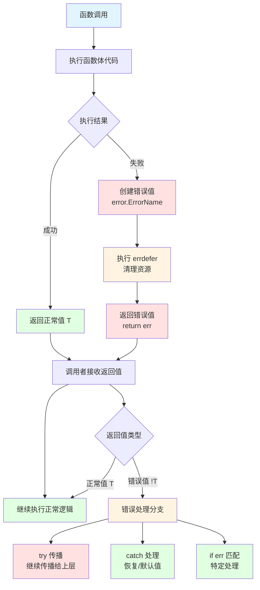

# 【draft】错误处理基础

错误处理是系统编程的核心课题之一。与许多语言使用异常（exception）或可选值（option）不同，Zig 采用了一套独特的错误处理机制，将错误作为语言的一等公民，通过**错误集合（Error Set）**和**错误联合类型（Error Union）**实现显式、零开销的错误处理。

Zig 错误处理的核心设计理念：

- **显式优于隐式**：函数签名必须声明可能返回的错误，调用者无法忽略错误
- **零开销**：错误类型在编译时确定，不引入运行时额外开销（如异常表、栈展开）
- **组合性**：错误集合可以合并、子集化，灵活应对不同层级的错误抽象需求
- **与 `try`/`catch` 配合**：提供简洁的错误传播和处理语法，同时保持控制流清晰可读

本章将介绍 Zig 错误处理的基础概念，包括错误集合定义、错误联合类型、`try`/`catch` 语法、`errdefer` 资源清理，以及错误处理的最佳实践。

## 为什么Zig不用异常？

Zig 选择显式错误处理而非异常机制，原因如下：

1. **可预测性**：控制流清晰可见，没有隐藏的跳转。C++ 异常可以在任意调用点抛出，调用者无法从函数签名得知可能的错误；Zig 的错误联合类型在签名中明确声明，`try`/`catch` 让错误传播路径一目了然
2. **性能**：无异常处理开销。C++ 异常需要栈展开（stack unwinding）和异常表，即使不抛出异常也有二进制大小和缓存的开销；Zig 的错误处理与返回值等价，成功路径零额外开销
3. **可读性**：函数签名明确声明可能返回的错误，调用者必须显式处理
4. **可调试性**：错误追踪完整，易于定位问题根源

## 错误集合

错误集合（Error Set）是 Zig 中定义错误类型的方式。它是一组命名的错误值的集合，类似于枚举类型，但专门用于错误处理。

### 为什么需要错误集合？

在 Zig 中，错误不是字符串或整数，而是**类型安全**的值。错误集合让我们能够：

- **编译时检查**：在编译时知道函数可能返回哪些错误
- **类型安全**：避免运行时错误类型不匹配的问题
- **语义清晰**：通过命名提供清晰的错误语义

与异常机制不同，Zig 的错误集合让错误处理成为函数签名的一部分，调用者必须显式处理可能的错误。

### 定义错误集合

```zig
const std = @import("std");

// 定义错误集合
const FileError = error{
    NotFound,
    PermissionDenied,
    OutOfMemory,
};

pub fn main(_: std.process.Init.Minimal) void {
    const err: FileError = FileError.NotFound;

    // 错误比较
    if (err == FileError.NotFound) {
        std.debug.print("文件未找到\n", .{});
    }
}
```

**错误值的全局唯一性**：Zig 中的错误值是全局唯一的整数。不同错误集中定义的同名错误实际上是同一个值：

```zig
const A = error{NotFound};
const B = error{NotFound};
// A.NotFound 和 B.NotFound 是同一个错误值
// 它们可以互相赋值，比较相等
```

这意味着错误名称在全局命名空间中是唯一的——这是 Zig 错误系统的基础设计。

**实际应用：配置文件错误集**

```zig
const ConfigError = error{
    FileNotFound,
    InvalidSyntax,
    MissingRequiredField,
    InvalidValue,
};

const Config = struct {
    port: u16,
    host: []const u8,
};

fn loadConfig(path: []const u8) ConfigError!Config {
    if (path.len == 0) {
        return error.FileNotFound;
    }
    return Config{ .port = 8080, .host = "localhost" };
}
```

### 错误集推断

Zig 编译器可以自动推断函数的错误集，无需手动声明。

**显式声明 vs 自动推断**：

```zig
// 方式1：显式声明错误集
fn explicitErrors() error{ FileNotFound, OutOfMemory }!void {
    // 函数实现...
}

// 方式2：让编译器自动推断
fn inferredErrors() !void {
    // 编译器会根据函数体中所有可能返回的错误自动推断错误集
    // 函数实现...
}
```

**简单示例**：

```zig
const std = @import("std");

// 编译器会自动推断错误集
fn divide(a: i32, b: i32) !i32 {
    if (b == 0) {
        return error.DivisionByZero;
    }
    if (a == std.math.minInt(i32) and b == -1) {
        return error.Overflow;
    }
    return @divTrunc(a, b);
}

// 等价于显式声明：
// fn divide(a: i32, b: i32) error{ DivisionByZero, Overflow }!i32 { ... }
```

**推断的优势**：
- 减少代码维护成本
- 错误集随函数实现自动更新
- 避免手动维护错误集列表

**注意事项**：
- 推断的错误集可以通过编译器的错误信息查看
- 在库的公共 API 中，建议显式声明错误集，便于用户理解和使用
- 在内部实现中，可以使用错误集推断以减少维护成本

### 错误集合并

在显式声明错误集时，如果函数可能返回多个不同来源的错误，可以使用 `||` 操作符合并错误集：

```zig
const FileError = error{
    NotFound,
    PermissionDenied,
};

const NetworkError = error{
    ConnectionFailed,
    Timeout,
};

// 合并错误集：包含两个错误集的所有错误
const CombinedError = FileError || NetworkError;
// CombinedError = error{ NotFound, PermissionDenied, ConnectionFailed, Timeout }
```

### 子集关系

如果错误集之间存在子集关系，子集可以隐式转换为超集：

```zig
const FileError = error{ NotFound, PermissionDenied };
const SpecificError = error{NotFound};

fn example() void {
    const specific: SpecificError = error.NotFound;

    // 子集可以隐式转换为超集
    const file: FileError = specific;  // ✅ 正确

    // 但超集不能隐式转换为子集
    // const back: SpecificError = file;  // ❌ 编译错误
}
```

### 错误集转换

当需要将较大的错误集转换为较小的错误集时，可以使用 `@errorCast`：

```zig
const LowLevelError = error{
    DiskError,
    NetworkError,
};

const HighLevelError = error{
    IOError,
    Timeout,
};

// 错误映射：手动将低级错误转换为高级错误
fn mapError(err: LowLevelError) HighLevelError {
    return switch (err) {
        error.DiskError => error.IOError,
        error.NetworkError => error.Timeout,
    };
}

fn highLevelOperation() HighLevelError!void {
    lowLevelOperation() catch |err| return mapError(err);
}

fn lowLevelOperation() LowLevelError!void {
    return error.DiskError;
}
```

`@errorCast` 用于将错误集缩小到目标类型，如果运行时错误值不在目标错误集中，会触发安全检查的非法行为：

```zig
const BroadError = error{ NotFound, PermissionDenied };
const SpecificError = error{NotFound};

fn narrow() SpecificError!void {
    const result = broad() catch |err| return @errorCast(err);
    _ = result;
}

fn broad() BroadError!void {
    return error.NotFound;
}
```

### anyerror 的使用

`anyerror` 是所有可能错误的超集，包含程序中定义的所有错误。

**使用场景**：
- 原型开发阶段，不确定具体错误类型时
- 与 C 代码交互时

**注意事项**：
- 会增加二进制大小（需要为所有错误生成错误处理代码和字符串表）
- 降低类型安全性（编译器无法检查具体错误类型）
- 应该在生产代码中避免使用

```zig
fn flexibleFunction() anyerror!void {
    // 可以返回任何错误
}
```

**推荐做法**：优先使用具体错误集，只在必要时使用 `anyerror`。

### 错误相关内建函数

Zig 提供了多个与错误处理相关的内建函数：

| 内建函数            | 作用                                    | 示例                                        |
| ------------------- | --------------------------------------- | ------------------------------------------- |
| `@errorCast`        | 将错误集转换为更小的错误集（超集→子集） | `@errorCast(err)`                           |
| `@intFromError`     | 获取错误值的整数表示                    | `@intFromError(error.NotFound)`             |
| `@errorFromInt`     | 从整数获取错误值                        | `@errorFromInt(@as(u16, 1))`                |
| `@errorName`        | 获取错误的字符串表示                    | `@errorName(error.NotFound)` → `"NotFound"` |
| `@errorReturnTrace` | 获取错误返回追踪                        | `@errorReturnTrace()`                       |

**`@errorName`** 在调试时特别实用：

```zig
const err = someOperation() catch |e| {
    std.debug.print("错误名称：{s}\n", .{@errorName(e)});
    return e;
};
```

**注意**：`@intFromError` 和 `@errorFromInt` 的整数表示在不同编译之间不稳定，应避免依赖具体的整数值。

## 错误联合类型

错误联合类型表示可能返回错误或正常值的类型。

**为什么需要错误联合类型？**

错误集合定义了可能的错误类型，但函数需要一种方式来表示"可能返回错误，也可能返回正常值"。错误联合类型通过 `!` 操作符将错误集和正常类型组合在一起。

**语法**：`ErrorSet!Type` 表示可能返回 `ErrorSet` 中的错误，或返回 `Type` 类型的正常值。

### 基本语法

```zig
const ParseError = error{
    InvalidFormat,
    OutOfRange,
};

// 错误联合类型：可能返回 i32 或 ParseError
fn parseNumber(str: []const u8) ParseError!i32 {
    if (str.len == 0) return ParseError.InvalidFormat;

    var result: i32 = 0;
    for (str) |char| {
        if (char < '0' or char > '9') return ParseError.InvalidFormat;
        result = result * 10 + (char - '0');
    }

    return result;
}
```

**省略错误集的写法**：`!Type` 等价于 `anyerror!Type`，表示可以返回任何错误。在函数签名中，`!Type` 通常表示让编译器推断错误集。

## 错误传播和处理

`try` 和 `catch` 是 Zig 错误处理的核心操作符，用于错误传播和错误处理。

### try：错误传播

`try` 用于将错误传播给调用者，避免在每个错误处理点重复编写错误处理代码。

**基本用法**：

```zig
fn divide(a: i32, b: i32) !i32 {
    if (b == 0) return error.DivisionByZero;
    return @divTrunc(a, b);
}

fn calculate() !i32 {
    // 如果 divide 失败，立即返回错误
    const result = try divide(10, 2);
    return result * 2;
}
```

**等价写法**：

```zig
// try divide(10, 2) 等价于：
const result = divide(10, 2) catch |err| {
    return err;
};
```

**使用限制**：`try` 只能在返回错误联合类型的函数中使用。在返回 `void` 或其他非错误联合类型的函数中使用 `try` 会导致编译错误：

```zig
// ❌ 错误：main 返回 void，不能使用 try
pub fn main(_: std.process.Init.Minimal) void {
    try mightFail();  // 编译错误
}

// ✅ 正确：main 返回 !void
pub fn main(_: std.process.Init.Minimal) !void {
    try mightFail();
}
```

### catch：错误处理

`catch` 用于在当前层级处理错误，提供恢复机制或默认值。

**用法 1：提供默认值**

```zig
// 捕获所有错误，返回默认值 0
const result = divide(10, 0) catch 0;
```

**用法 2：捕获错误并处理**

```zig
fn example() void {
    const result = divide(10, 0) catch |err| {
        std.debug.print("错误：{}\n", .{err});
        return;
    };
    std.debug.print("结果：{}\n", .{result});
}
```

**用法 3：catch unreachable**

当逻辑上确定不会出错时，可以使用 `catch unreachable` 断言：

```zig
// "42" 一定可以解析为整数，逻辑上不可能失败
const value = parseU32("42") catch unreachable;
```

`unreachable` 在 Debug/ReleaseSafe 模式下会触发安全检查的非法行为，在 ReleaseFast 模式下是未定义行为。仅在可以**证明**不会出错时使用。

### 错误匹配

使用 `switch` 匹配不同的错误类型，执行不同的处理逻辑：

```zig
const FileError = error{
    NotFound,
    PermissionDenied,
    DiskFull,
};

fn processFile() FileError!void {
    // 可能返回不同的错误
}

fn handleFile() void {
    processFile() catch |err| switch (err) {
        error.NotFound => std.debug.print("文件未找到\n", .{}),
        error.PermissionDenied => std.debug.print("权限不足\n", .{}),
        error.DiskFull => std.debug.print("磁盘已满\n", .{}),
    };
}
```

**注意事项**：
- `switch` 必须处理所有可能的错误
- 可以使用 `else` 分支处理其他错误

### if 表达式：分别处理成功和失败

使用 `if` 表达式可以分别处理成功和失败情况：

```zig
const std = @import("std");

fn example() void {
    if (divide(10, 2)) |value| {
        // 成功时执行
        std.debug.print("成功：{}\n", .{value});
    } else |err| {
        // 失败时执行
        std.debug.print("失败：{}\n", .{err});
    }
}
```

**与 catch 的区别**：
- `catch`：主要用于错误处理，成功时直接获取值
- `if`：分别处理成功和失败，两者都可以有复杂逻辑

## errdefer

`errdefer` 用于在函数返回**错误**时执行清理操作。它与 `defer` 的关键区别是：`defer` 无论成功失败都会执行，而 `errdefer` **仅在返回错误时执行**。

### defer vs errdefer

```zig
// defer：无论成功还是失败，都会执行
fn withDefer(allocator: std.mem.Allocator) !void {
    const memory = try allocator.alloc(u8, 100);
    defer allocator.free(memory);  // ✅ 成功和失败都会释放
    // ... 使用 memory ...
}

// errdefer：仅在失败时执行
fn withErrdefer(allocator: std.mem.Allocator) ![]u8 {
    const memory = try allocator.alloc(u8, 100);
    errdefer allocator.free(memory);  // ✅ 仅失败时释放
    // 成功时将 memory 返回给调用者，调用者负责释放
    return memory;
}
```

**选择原则**：
- 资源在函数内完成生命周期 → 使用 `defer`
- 资源在成功时转移给调用者 → 使用 `errdefer`

### 基本用法

`errdefer` 最典型的场景是**所有权转移**：函数成功时将资源返回给调用者，仅在失败时才需要清理：

```zig
const std = @import("std");

const User = struct {
    id: usize,
    name: []const u8,
};

fn createUser(allocator: std.mem.Allocator, id: usize, name: []const u8) !*User {
    const user = try allocator.create(User);
    errdefer allocator.destroy(user);  // 失败时释放，成功时调用者拥有 user

    user.* = User{ .id = id, .name = name };

    if (id == 0) {
        return error.InvalidUserId;  // errdefer 会执行，释放 user
    }

    return user;  // 成功：调用者负责释放 user
}
```

如果这里使用 `defer`，则成功返回后 `user` 会被立即销毁，调用者拿到的就是悬空指针——这正是 `errdefer` 存在的意义。

### 多资源管理

当函数需要分配多个资源时，每个 `errdefer` 负责清理自己对应的资源，确保部分初始化失败时不会泄漏：

```zig
const std = @import("std");

const Config = struct {
    name: []const u8,
    items: []u32,
};

fn loadConfig(allocator: std.mem.Allocator, name: []const u8, count: usize) !*Config {
    const config = try allocator.create(Config);
    errdefer allocator.destroy(config);  // 第 2 步失败时清理 config

    const items = try allocator.alloc(u32, count);
    errdefer allocator.free(items);  // 第 3 步失败时清理 items

    config.* = Config{
        .name = name,
        .items = items,
    };

    if (count > 1000) {
        return error.TooManyItems;  // errdefer 按相反顺序执行：free(items) → destroy(config)
    }

    return config;  // 成功：调用者拥有 config 及其 items
}
```

**关键点**：
- 每个 `try` 之后紧跟对应的 `errdefer`，确保该步失败时之前获取的资源被清理
- 多个 `errdefer` 按 LIFO（后进先出）顺序执行，与资源获取顺序相反
- 成功时所有资源通过 `config` 一起返回，调用者负责最终释放

### 执行顺序

多个 `errdefer` 按相反顺序执行（LIFO - 后进先出）：

```zig
fn example() !void {
    const resource1 = try acquire1();
    errdefer release1(resource1);  // 第 3 个执行

    const resource2 = try acquire2();
    errdefer release2(resource2);  // 第 2 个执行

    const resource3 = try acquire3();
    errdefer release3(resource3);  // 第 1 个执行

    // 如果出错，执行顺序：release3 → release2 → release1
}
```

### 错误捕获：errdefer |err|

`errdefer` 支持捕获错误值，可以在清理时根据错误类型执行不同逻辑：

```zig
const std = @import("std");

fn sendRequest(url: []const u8) !void {
    std.debug.print("发送请求到 {s}\n", .{url});

    errdefer |err| {
        std.debug.print("请求失败：{}\n", .{err});
    }

    if (std.mem.startsWith(u8, url, "https://") == false) {
        return error.InvalidUrl;
    }

    // 模拟网络请求...
    return error.Timeout;
}
```

**常见用途**：
- 记录失败原因的日志
- 根据错误类型执行不同的清理逻辑
- 在清理时附加错误上下文信息

## 错误处理流程



## 完整示例

```zig
const std = @import("std");

const Buffer = struct {
    data: []u8,
    len: usize,
};

fn createBuffer(allocator: std.mem.Allocator, content: []const u8, max_size: usize) !Buffer {
    if (content.len == 0) {
        return error.EmptyContent;
    }
    if (content.len > max_size) {
        return error.ContentTooLarge;
    }

    const data = try allocator.alloc(u8, max_size);
    errdefer allocator.free(data);  // 仅失败时释放，成功时返回给调用者

    @memcpy(data[0..content.len], content);

    return Buffer{ .data = data, .len = content.len };
}

pub fn main(_: std.process.Init.Minimal) !void {
    var gpa: std.heap.DebugAllocator(.{}) = .init;
    defer _ = gpa.deinit();
    const allocator = gpa.allocator();

    const content = "Hello, Zig!";
    const result = createBuffer(allocator, content, 1024) catch |err| {
        std.debug.print("创建缓冲区失败: {}\n", .{err});
        return err;
    };
    defer allocator.free(result.data);  // 使用完毕后释放

    std.debug.print("缓冲区 {} 字节：{s}\n", .{ result.len, result.data[0..result.len] });
}
```

## 性能考虑

### 内存布局

```zig
// 小类型：使用标记位
// !i32 在内存中占用 4 字节 + 标记位
// 标记位用于区分错误和正常值

// 大类型：使用联合体
// !LargeStruct 在内存中占用 max(sizeof(Error), sizeof(LargeStruct))
```

### 性能特性

- **成功路径**：零开销（无额外检查）
- **错误路径**：有少量开销（错误值传递）
- **与异常比较**：
  - 无栈展开开销
  - 无异常表
  - 无隐藏的控制流

## 最佳实践

### 定义清晰的错误类型

```zig
// ✅ 好的做法：语义化的错误名称
const ConfigError = error{
    FileNotFound,
    InvalidFormat,
    MissingRequiredField,
    ValueOutOfRange,
};

// ❌ 不好的做法：模糊的错误名称
const Error = error{
    Failed,
    Error,
    Bad,
};
```

### 错误传播与处理原则

1. **优先使用 `try` 传播错误**：让调用者决定如何处理，除非当前层级有明确的恢复策略
2. **在当前层级能处理时使用 `catch`**：提供默认值或恢复逻辑，而非无条件传播
3. **使用 `defer` 管理函数内资源**：资源在函数内完成生命周期时，始终使用 `defer`，不要用 `errdefer` + 手动清理
4. **使用 `errdefer` 管理所有权转移**：资源在成功时返回给调用者时，用 `errdefer` 确保失败时清理
5. **优先使用具体错误集**：避免 `anyerror`，让编译器帮你检查错误处理的完整性
6. **公共 API 显式声明错误集**：便于用户理解函数可能返回哪些错误

## 常见错误与调试

### 常见编译错误

#### 错误1：在非错误联合函数中使用 try

```zig
// ❌ 错误示例：main 返回 void，不能使用 try
pub fn main(_: std.process.Init.Minimal) void {
    try mightFail();  // 编译错误：try 在非错误联合返回类型函数中不可用
}

// ✅ 正确做法：将返回类型改为错误联合类型
pub fn main(_: std.process.Init.Minimal) !void {
    try mightFail();
}
```

#### 错误2：错误集不兼容

超集不能隐式转换为子集，需要显式处理：

```zig
const SpecificError = error{NotFound};
const BroadError = error{NotFound, PermissionDenied};

fn broad() BroadError!void {
    return error.PermissionDenied;
}

// ❌ 错误示例：BroadError 不能隐式转换为 SpecificError
fn narrow() SpecificError!void {
    return broad();  // 编译错误：错误集不兼容
}

// ✅ 正确做法1：使用 @errorCast 显式转换（运行时安全检查）
fn narrow() SpecificError!void {
    broad() catch |err| return @errorCast(err);
}

// ✅ 正确做法2：逐个映射错误
fn narrow() SpecificError!void {
    broad() catch |err| switch (err) {
        error.NotFound => return error.NotFound,
        error.PermissionDenied => return error.PermissionDenied,  // 需要处理所有错误
    };
}
```

### 常见运行时错误

#### 错误1：未处理的错误

```zig
// ❌ 错误示例
fn main() void {
    mightFail();  // 错误：未处理可能的错误
}

// ✅ 正确做法
fn main() !void {
    try mightFail();
}
```

#### 错误2：误用 errdefer 替代 defer

当资源在成功和失败路径上都需要清理时，应使用 `defer`，而非 `errdefer` + 手动清理：

```zig
// ❌ 错误示例：errdefer + 手动清理，容易遗漏
fn processFile(path: []const u8) !void {
    const file = try openFile(path);
    errdefer file.close();  // 仅失败时执行

    try process(file);

    file.close();  // 成功时手动清理——容易忘记
}

// ✅ 正确做法：使用 defer，无论成功失败都清理
fn processFile(path: []const u8) !void {
    const file = try openFile(path);
    defer file.close();  // 成功和失败都会执行

    try process(file);
}
```

另一种常见错误：在 `errdefer` 场景中忘记成功路径也需要处理资源：

```zig
// ❌ 错误示例：errdefer 只在失败时执行，成功时资源泄漏
fn allocateAndProcess(allocator: std.mem.Allocator) !void {
    const memory = try allocator.alloc(u8, 100);
    errdefer allocator.free(memory);  // 仅失败时释放

    try process(memory);
    // 成功返回时，memory 没有被释放，也没有转移给调用者——泄漏！
}

// ✅ 正确做法1：函数内完成生命周期，使用 defer
fn allocateAndProcess(allocator: std.mem.Allocator) !void {
    const memory = try allocator.alloc(u8, 100);
    defer allocator.free(memory);  // 无论成功失败都释放

    try process(memory);
}

// ✅ 正确做法2：成功时转移所有权，使用 errdefer
fn allocateForCaller(allocator: std.mem.Allocator) ![]u8 {
    const memory = try allocator.alloc(u8, 100);
    errdefer allocator.free(memory);  // 仅失败时释放

    try initialize(memory);

    return memory;  // 成功：调用者负责释放
}
```

### 调试技巧

#### 技巧1：打印错误信息

```zig
const std = @import("std");

pub fn main(_: std.process.Init.Minimal) void {
    const result = riskyOperation() catch |err| {
        std.debug.print("错误: {}\n", .{err});
        return;
    };
    std.debug.print("成功: {}\n", .{result});
}
```

#### 技巧2：打印堆栈追踪

```zig
const std = @import("std");

pub fn main(_: std.process.Init.Minimal) void {
    riskyOperation() catch |err| {
        std.debug.print("错误: {}\n", .{err});
        std.debug.dumpCurrentStackTrace(null);
    };
}
```

#### 技巧3：使用安全检查模式

```bash
# Debug 模式：启用所有安全检查
zig build-exe app.zig

# ReleaseSafe 模式：启用优化但保留安全检查
zig build-exe app.zig -O ReleaseSafe

# ReleaseFast 模式：最大优化，禁用安全检查
zig build-exe app.zig -O ReleaseFast
```
